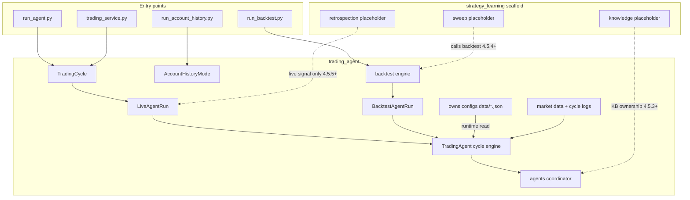
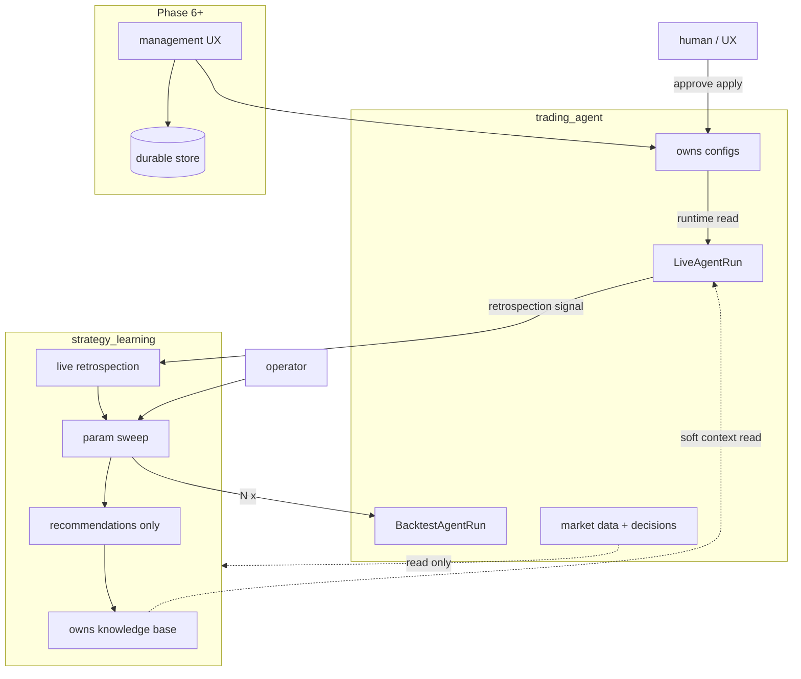

# Trading Agent — Project Plan

Last updated: 2026-07-12

## Overview

An **LLM-orchestrated trading platform** that runs periodic cycles: gather market intelligence → formulate strategies → execute trades → log outcomes → learn over time.

Two top-level packages share the repo:

| Package | Role |
|---------|------|
| **`trading_agent`** | Live trading, brokers, market data, cycle/decision logs, **config ownership** (`data/*.json` params), and backtest engine (bundled through Phase 4.5) |
| **`strategy_learning`** | Offline tuning: knowledge base, recommendations, param sweep, live retrospection (scaffold in 4.5.1; logic in 4.5.3–4.5.5) |

Persistence, management UX, and multi-tenant support follow in later phases. Phase **11** decouples `strategy_learning` into its own deploy/schedule.

### Current architecture (Phase 4.5.2 — live/backtest runs + learning scaffold)

**Update this diagram** when changing the trading or learning pipeline (see `docs/agents/development.md`).

### Target architecture (after Phase 4.5 + Phase 11)

### Data and package boundary

| Data | Owner | `strategy_learning` | `trading_agent` |
|------|-------|---------------------|-----------------|
| Knowledge base + recommendations | **`strategy_learning`** (target) | Read/write | Read soft context for prompts only |
| Configs (`strategy_params`, prefs, …) | **`trading_agent`** (future: management UX) | **Never writes** | Runtime **reads**; human/UX **applies** approvals |
| Market data, cycle/decision artifacts | **`trading_agent`** | Read-only for learning | Writes during live/backtest |

**Rules:** Backtest stays in `trading_agent` through 4.5 (sweep *calls* it). Only **live** runs may trigger retrospection/sweep — never backtest runs (Phase 4.5.2). Deploy (`trading_service.py`) is live-only.

---

## Phase status

| Phase                                                      | Status          | Summary                                                                                 |
| ---------------------------------------------------------- | --------------- | --------------------------------------------------------------------------------------- |
| **Phase 1** — Paper-trading MVP                            | **Done**        | E2E cycle, env config, JSON decisions, artifacts, tests                                 |
| **Phase 1.5** — Valid trades + layered architecture        | **Done**        | Domain models, all-analysis runner, trade preparation, enriched portfolio               |
| **Phase 1.6** — Account history mode                       | **Done**        | Read-only snapshot + equity history; `run_account_history.py`; monthly aggregation      |
| **Phase 2** — Richer market context                        | **Done**        | RSI/MACD, sector ETFs, Finnhub news, FMP fundamentals in prompts                        |
| **Phase 3** — Backtesting                                  | **Done**        | Historical replay via TradingAgent; benchmarks; `run_backtest.py`; per-provider cache   |
| **Phase 4** — Multi-agent architecture                     | **Done**        | Analyzer, strategizer, executor, logger, learner; `trading_agent/agents/` + coordinator |
| **Phase 4.5** — Learning loop                              | **In progress** | A/B done; sub-phases 4.5.1–4.5.5 (see below)                                            |
| **Phase 5** — Multi-broker                                 | **Done**        | `BrokerClient` + Alpaca, Robinhood (optional), mock                                     |
| **Phase 6** — Data persistence                             | Planned         | DB for prefs, history, confirmations, knowledge base                                    |
| **Phase 7** — Manageability UX                             | Planned         | Console for agents, LLM config, activity and history                                    |
| **Phase 8** — Sign up & authentication                     | Planned         | Registration, sign-in, user-scoped experience                                           |
| **Phase 9** — Multi-customer isolation                     | Planned         | Strict per-user data boundaries; no cross-user influence                                |
| **Phase 10** — Production hardening                        | Planned         | Secrets, risk guardrails, observability, scale                                          |
| **Phase 11** — Strategy learning service                   | Planned         | Decouple `strategy_learning` deploy/schedule from live trading                          |

---

## Phase 1: Paper-trading MVP — COMPLETE

**Goal:** One complete paper-trading cycle with real Alpaca data + configurable LLM, producing a readable artifact.

### Delivered

- **Config** — `trading_agent/config.py`, `.env.example` (`LLM_PROVIDER`, `LLM_MODEL`, `TRADING_CYCLE_INTERVAL`, Alpaca keys)
- **Reliable LLM loop** — JSON decision parsing in `trading_agent/models.py`; empty decisions = HOLD
- **Market context in prompts** — `format_market_conditions()` fed into analysis and strategy
- **Dependency injection** — `TradingAgent` accepts injected `alpaca_client`
- **MVP entry point** — `run_agent.py`: validate config, run cycle, save `logs/cycle_*.json`, print summary with trade **Details** column
- **Gemini defaults** — migrated from deprecated `gemini-2.0-flash` to `gemini-3.1-flash-lite-preview`; `scripts/verify_gemini_setup.py`
- **Tests** — decision parsing, trading cycle integration (mock LLM/Alpaca), trade failure formatting, scheduler (10 tests)
- **Deploy/docs touch** — `docker-compose.yml` Dockerfile path, README MVP section

### Known follow-ups (post-merge) — addressed in Phase 1.5

- ~~**Pre-trade validation**~~ — `TradePreparer` + `TradeValidator` clip/skip before broker submit
- ~~**Dedupe decisions**~~ — `TradeConsolidator` merges strategy + rebalancer orders
- **Rebalancing order parsing** — LLM sometimes outputs non-numeric qty (still possible)
- **Finnhub live integration** — done in Phase 2 (`FinnhubNewsProvider`)

---

## Phase 1.6: Account history mode — COMPLETE

**Goal:** Read-only account snapshot and portfolio equity history, separate from the trading cycle.

### Delivered

- **Domain models** — `trading_agent/domain/account/` (`AccountSnapshot`, `AccountHistoryResult`)
- **Fetcher** — `AccountHistoryFetcher` with query resolver and monthly aggregation
- **Broker API** — `AlpacaTradingClient.get_portfolio_history()`
- **Entry point** — `run_account_history.py` (Alpaca keys only; no LLM)
- **Artifacts** — `logs/account_history_<timestamp>.json`
- **Tests** — `tests/test_account_history.py`
- **Docs** — `docs/agents/account-history.md`

---

## Phase 2: Richer Market Context — COMPLETE

**Goal:** Ground LLM decisions in real, recent market signals. Feeds the future **Market Analyzer** agent (Phase 4).

### Delivered

- **Technical indicators** — `trading_agent/signals/indicators.py` (RSI, MACD, SMA); computed for SPY + portfolio symbols via `get_bars()`
- **Sector ETFs** — 10 sector SPDRs in `AlpacaMarketDataProvider` with 5d relative strength vs SPY
- **Live Finnhub news** — company + general headlines; `FINNHUB_API_KEY` optional
- **Live FMP fundamentals** — P/E, ROE, revenue growth, earnings via `FMPFundamentalsProvider`; `FMP_API_KEY` optional
- **Signal aggregation** — enriched `SignalAggregator` with `SignalCollectionContext` in `signals/sources.py`
- **Prompt formatters** — richer `format_market_signals()` and sector rotation in `format_market_conditions()`
- **Tests** — `test_indicators.py`, `test_signal_aggregator.py`, live integration tests for Finnhub/FMP
- **Docs** — `docs/agents/market-signals.md`

### Reference (original plan)

| Work item                     | Approach                                                       |
| ----------------------------- | -------------------------------------------------------------- |
| Deeper market data in prompts | Index prices, SMA trend, volatility, sector ETFs (XLK, XLV, …) |
| News / sentiment              | `NewsDataProvider` ABC; Finnhub REST + heuristic sentiment     |
| Real technical indicators     | Compute RSI/MACD in Python; inject into analysis prompts       |
| Fundamentals                  | Earnings, PE via Financial Modeling Prep                       |
| Extensible signal plugins     | Provider injection on `TradingAgent` / `SignalAggregator`      |

---

## Phase 3: Backtesting Mode — COMPLETE

**Goal:** Evaluate the user's LLM strategy on historical data against industry-standard benchmarks. Feeds the **Trading Strategizer** (Phase 4).

### Delivered

- **Historical data (shared)** — `data/cache/alpaca/` (bars CSV + manifest), `data/cache/finnhub/` (news JSON); `HistoricalAlpacaProvider` / `HistoricalFinnhubProvider` with `as_of_date`
- **Backtest package** — `trading_agent/backtest/` (`BacktestEngine`, `BacktestBroker`, benchmarks, metrics, comparison)
- **Reuse live agent** — engine invokes `TradingAgent.run_trading_cycle()` with injected historical providers + simulated broker; loads user config from the same stores as `TradingCycle`
- **Cadence** — weekly rebalance dates by default (daily optional); daily mark-to-market for equity curve
- **Benchmarks** — SPY/QQQ B&H, 60/40 SPY/AGG, SMA(20/50), equal-weight B&H
- **Metrics** — total return, CAGR, max drawdown, volatility, Sharpe, alpha/beta vs SPY
- **CLI** — `run_backtest.py` (manual; `--prefetch-only`, `--override-strategy`, `--compare`)
- **Artifacts** — `logs/backtest_<timestamp>_<label>.json` with config snapshot for repeatable tuning
- **Tests** — `test_historical_data`, `test_backtest_broker_metrics`, `test_backtest_engine`
- **Docs** — `docs/agents/backtesting.md`

### Known limitations (v1)

- FMP fundamentals are TTM (not point-in-time); backtest uses mock/empty fundamentals slice
- Corporate actions ignored; LLM non-determinism — compare runs with model/config snapshots

### Reference (original plan)

| Work item            | Approach                                        |
| -------------------- | ----------------------------------------------- |
| Historical replay    | Point-in-time providers + `BacktestEngine` loop |
| Simulated fills      | `BacktestBroker` at bar close                   |
| Benchmarks + metrics | Passive + SMA baselines; Sharpe/drawdown/alpha  |
| Manual CLI           | `run_backtest.py` (not scheduler)               |

---

## Phase 4: Multi-Agent Architecture

**Goal:** Replace the monolithic `TradingAgent` with specialized agents that collaborate on each cycle. Each agent has a clear contract, can use its own LLM prompt/model, and can be extended independently.

### Agents

| Agent                    | Role                                        | Inputs                                                                         | Outputs                                                                                   |
| ------------------------ | ------------------------------------------- | ------------------------------------------------------------------------------ | ----------------------------------------------------------------------------------------- |
| **Market Analyzer**      | Synthesize market picture from many signals | Price data, news, sentiment, indicators, sector trends (extensible)            | Structured **market summary**: trend, sentiment, risks, key themes                        |
| **Trading Strategizer**  | Propose and compare strategies              | Market summary, portfolio state, backtest results, lessons from knowledge base | 2–N **strategy options** with trade-offs; **selected strategy** with rationale            |
| **Trade Executor**       | Turn strategy into orders and execute       | Selected strategy, account/positions, risk rules                               | Concrete orders; broker responses; execution report                                       |
| **Decision Logger**      | Record everything for audit and learning    | All agent inputs/outputs, orders, fills                                        | Append-only **decision log** per cycle (feeds Phase 6 persistence)                        |
| **Learner & Summarizer** | Reflect on outcomes over time               | Historical logs, PnL, win/loss patterns                                        | **Lessons learned** in knowledge base; suggested weight tweaks for signals and strategies |

### Orchestration

- **Cycle coordinator** — replaces or wraps `TradingCycle`; invokes agents in order, passes structured payloads (not raw LLM text)
- **Agent registry** — configure which agents run, their LLM models, and enable/disable signal sources
- **Feedback loop** — Learner updates knowledge base → Market Analyzer adjusts source weights → Strategizer adjusts strategy preferences

### Migration path from Phase 1

| Today                                 | Becomes                             |
| ------------------------------------- | ----------------------------------- |
| `trading_agent/analysis/*`            | Market Analyzer (initial impl)      |
| `GeneralTradingStrategy` + rebalancer | Trading Strategizer (initial impl)  |
| `trader.execute_trades()`             | Trade Executor                      |
| `logs/cycle_*.json`                   | Decision Logger (structured schema) |
| (none)                                | Learner & Summarizer (new)          |

### Deliverables

- Agent ABC + message schemas (Pydantic/dataclasses)
- Coordinator pipeline with mock agents for tests
- Per-agent prompts isolated under e.g. `trading_agent/agents/`
- End-to-end paper cycle through all five agents

### Delivered

- `trading_agent/agents/` — ABC, messages, registry, `CycleCoordinator`
- **Wrappers** — Market Analyzer (`SignalAggregator` + `AnalysisRunner`), Strategizer (strategy + rebalancer), Trade Executor agent (preparer + executor), Decision Logger (`CycleResult` + optional artifact), Learner (file KB)
- **Knowledge base** — `data.example/knowledge_base.json` → `data/knowledge_base.json`
- **Compat** — `TradingAgent.run_trading_cycle` delegates to coordinator (backtests unchanged)
- **Tests** — `tests/test_multi_agent.py`; existing cycle integration still green
- **Docs** — `docs/agents/multi-agent.md`

### Feedback loop status (scaffold vs closed loop)

Phase 4 delivered the **structural** loop (logger → learner → file KB → analyzer/strategizer params). Soft fields were not fully prompted and backtests could pollute the live KB. **Phase 4.5** closes the semantic loop (see below).

---

## Phase 4.5: Learning Loop

**Goal:** Clear, auditable tuning with a hard split: `strategy_learning` owns the knowledge base and recommendations; `trading_agent` owns configs (runtime read; human/UX apply). Soft context still reaches live prompts; hard config changes require human approval.

**Doc:** [`docs/agents/learning-loop.md`](agents/learning-loop.md) · Package scaffold: [`strategy_learning/`](../strategy_learning/)

### Delivered (A + B + 4.5.1 + 4.5.2)

- Backtest disables `LearnerAgent` (no per-cycle KB pollution)
- Analysis/strategy prompts include lessons, signal weights, `recent_trade_bias`
- KB schema v2 with `user_id`, typed records, EventRef provenance, v1 migration
- `BacktestFeedbackAgent` + `run_backtest.py --feedback`
- Review CLI (`scripts/review_config_recommendation.py`) and lineage (`scripts/kb_lineage.py`)
- Learner patches `lessons_update` onto cycle artifacts; backtest summaries include `cycle_id`
- `strategy_learning/` **scaffold** + architecture/docs aligned to package and data boundaries (no runtime move yet)
- `LiveAgentRun` / `BacktestAgentRun` wrappers; circular-trigger guard; deploy = live only

### Sub-phases (execute in order)

| Sub-phase                         | Status   | Summary                                                                                             |
| --------------------------------- | -------- | --------------------------------------------------------------------------------------------------- |
| **4.5.1** — Structure + docs      | **Done** | `strategy_learning/` scaffold; diagrams and agent docs; no behavior change                          |
| **4.5.2** — Live vs Backtest runs | **Done** | `LiveAgentRun` / `BacktestAgentRun`; retrospection only on live; deploy = live only                 |
| **4.5.3** — Data boundary         | Planned  | KB + rec writes in `strategy_learning`; configs stay trading_agent-owned; apply not in learning pkg |
| **4.5.4** — Param sweep           | Planned  | Parallel N backtests → `SweepResult`; **sole** recommendation producer                              |
| **4.5.5** — Live retrospection    | Planned  | Live underperf → out-of-band sweep; mark 4.5 complete                                               |

Walk-forward gate API (`--require-validate-window`) already exists for production promotes.

---

## Phase 5: Multi-Broker Support

**Status: Done** — see [multi-broker.md](agents/multi-broker.md).

- `BrokerClient` protocol returns typed domain models (`BrokerAccount`, `BrokerPosition`, …)
- `build_broker_client()` factory; `BROKER_PROVIDER` env + `data/brokerage_config.json`
- `AlpacaBrokerClient` (default, paper via `ALPACA_PAPER`), `MockBrokerClient`, optional `RobinhoodBrokerClient`
- Pipeline wired via `broker_client` injection; market data remains Alpaca-decoupled

**TODO (follow-up):** Live Robinhood E2E verification — run `tests/integration/test_robinhood_live.py`, `run_account_history.py`, and `run_agent.py` with `BROKER_PROVIDER=robinhood` against a real account (no paper mode). See [multi-broker.md](agents/multi-broker.md).

---

## Phase 6: Data Persistence

**Goal:** Move from file-based logs to durable storage for everything the platform needs to remember.

| Domain                   | Stored data                                                                                |
| ------------------------ | ------------------------------------------------------------------------------------------ |
| **User preferences / configs** | Risk, LLM, signals, strategy params — **trading_agent** (or management UX) domain |
| **Confirmations** | User approvals for trades, strategy selections, config changes |
| **Trading history** | Cycles, decisions, orders, fills, PnL snapshots — **trading_agent** domain |
| **Knowledge base** | Lessons, validations, recommendations — **`strategy_learning`** domain (after 4.5.3) |
| **Activity log** | Agent runs, errors, latency, token usage |

### Approach

- Start local: **SQLite** or **PostgreSQL** with clear schema per domain
- Production: managed RDS / DynamoDB + S3 for large artifacts
- Replace `logs/cycle_*.json` as source of truth; files become optional export
- APIs for agents and UX to read/write scoped records (user_id added in Phase 9)

---

## Phase 7: Manageability UX

**Goal:** Web (or desktop) console to operate the platform without editing `.env` or reading raw JSON logs.

| Area                      | Features                                                             |
| ------------------------- | -------------------------------------------------------------------- |
| **Agent management**      | Enable/disable agents; view agent config; trigger manual cycle       |
| **LLM configuration**     | Per-agent provider, model, temperature; test prompt                  |
| **Preferences**           | Risk settings, watchlists, strategy defaults                         |
| **Activity & history**    | Cycle timeline, decision drill-down, trade outcomes, failure details |
| **Knowledge base viewer** | Browse lessons / recommendations from `strategy_learning` KB; config apply remains trading_agent / UX |

### Approach

- API layer (FastAPI or similar) over Phase 6 persistence + agent coordinator
- Frontend: simple React/Vue dashboard (or extend existing tooling)
- Auth-gated (Phase 8); all views scoped to signed-in user

---

## Phase 8: Sign Up & Authentication

**Goal:** Users can register, sign in, and see only their own trading world.

| Work item          | Approach                                                                                |
| ------------------ | --------------------------------------------------------------------------------------- |
| Registration       | Email/password or OAuth (Google, GitHub); email verification optional                   |
| Sign in / session  | JWT or session cookies; secure password storage                                         |
| Signed-in UX       | All Phase 7 screens show user name, portfolio, cycles, and prefs for **this user only** |
| Broker credentials | Per-user encrypted storage of Alpaca/API keys (not shared)                              |
| Onboarding         | First-run flow: connect paper account, set preferences, run first cycle                 |

Builds on Phase 6 (user record in DB) and Phase 7 (authenticated UI routes).

---

## Phase 9: Multi-Customer Isolation

**Goal:** Multiple independent users on one deployment with **strict isolation** — no data leakage and no cross-user influence on trading decisions.

| Requirement            | Implementation                                                                                                              |
| ---------------------- | --------------------------------------------------------------------------------------------------------------------------- |
| Data isolation         | Every row keyed by `user_id`; queries always filtered; no shared knowledge base across users                                |
| Agent run isolation    | Each cycle runs in user context only (portfolio, prefs, history, lessons)                                                   |
| No cross-user learning | Learner agent writes/reads knowledge **per user**; optional platform-wide anonymized aggregates only if explicitly designed |
| Resource limits        | Per-user rate limits on LLM and broker API calls                                                                            |
| Testing                | Integration tests prove user A cannot read or affect user B's cycles                                                        |

Depends on Phase 6 (persistence), Phase 8 (auth identity). Required before any shared/hosted production offering.

---

## Phase 10: Production Hardening

Lower priority until multi-agent + persistence + auth are proven in paper trading:

- ECS secrets / task env vars (no `.env` baked into image)
- CI deploy only on `main`; pin image by SHA
- Pre-trade risk guardrails in code (position limits, daily loss, symbol whitelist)
- Limit/stop/bracket orders; order status polling
- CloudWatch alarms and health checks
- Broader test coverage; load testing for multi-tenant API
- Compliance hooks (audit export, retention policies)

---

## Phase 11: Strategy Learning Service

**Goal:** Run `strategy_learning` on its own schedule/deployment. Live trading emits durable retrospection signals (queue/file/DB); learning never runs in-process inside the trading cycle deploy.

Depends on Phase 4.5.5. Out of scope until the learning loop is complete inside the monorepo.

---

## Recommended execution order

1. ~~Phase 1 MVP~~ ✓
2. ~~Phase 2~~ — richer market context ✓
3. ~~Phase 1 follow-ups~~ — pre-trade validation, dedupe ✓
4. ~~Phase 3~~ — backtesting ✓
5. ~~**Phase 4** — multi-agent architecture~~ ✓
6. **Phase 4.5** — learning loop (~~4.5.1~~ ✓ → ~~4.5.2~~ ✓ → 4.5.3 data boundary → 4.5.4 sweep → 4.5.5 retrospection)
7. ~~**Phase 5** — multi-broker~~ ✓
8. **Phase 6** — data persistence (before UX and multi-user)
9. **Phase 7** — manageability UX
10. **Phase 8** — sign up & authentication
11. **Phase 9** — multi-customer isolation (harden before hosted launch)
12. **Phase 10** — production hardening before live money at scale
13. **Phase 11** — strategy learning service (after 4.5)

---

## Key paths (quick reference)

| Area                         | Path                                                                                        |
| ---------------------------- | ------------------------------------------------------------------------------------------- |
| Single-cycle entry           | `run_agent.py`                                                                              |
| Account history entry        | `run_account_history.py`                                                                    |
| Backtest entry               | `run_backtest.py`                                                                           |
| Scheduled service            | `trading_service.py` → `trading_agent/scheduler/`                                           |
| Cycle wrapper                | `trading_agent/orchestrator/trading_cycle.py`                                               |
| Live / backtest run modes    | `trading_agent/orchestrator/agent_run.py` (`LiveAgentRun`, `BacktestAgentRun`)              |
| Account history mode         | `trading_agent/orchestrator/account_history.py`                                             |
| Account history fetcher      | `trading_agent/account/`                                                                    |
| Core orchestrator            | `trading_agent/orchestrator/agent.py` (`TradingAgent` facade)                               |
| Multi-agent package          | `trading_agent/agents/`                                                                     |
| Strategy learning (scaffold) | `strategy_learning/`                                                                        |
| Learning loop (current impl) | `trading_agent/agents/backtest_feedback.py`, `promotion.py`; `docs/agents/learning-loop.md` |
| Backtest engine              | `trading_agent/backtest/`                                                                   |
| Historical market data       | `trading_agent/market_data/alpaca_historical.py`, `finnhub_historical.py`                   |
| Config                       | `trading_agent/config.py`                                                                   |
| Models / parsing             | `trading_agent/models.py`                                                                   |
| LLM clients                  | `trading_agent/llm/`                                                                        |
| Strategies                   | `trading_agent/strategies/`                                                                 |
| Market data                  | `trading_agent/market_data/`                                                                |
| Broker                       | `trading_agent/broker/`                                                                     |
| Tests                        | `tests/`                                                                                    |
| Agent docs                   | `docs/agents/`                                                                              |

