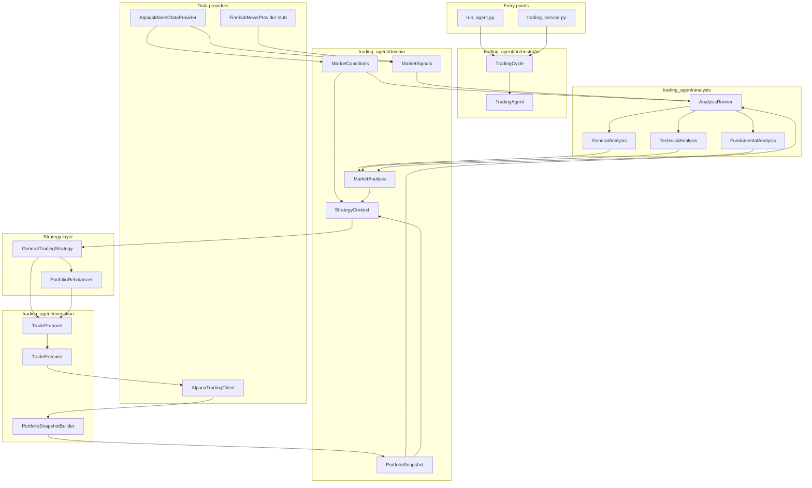
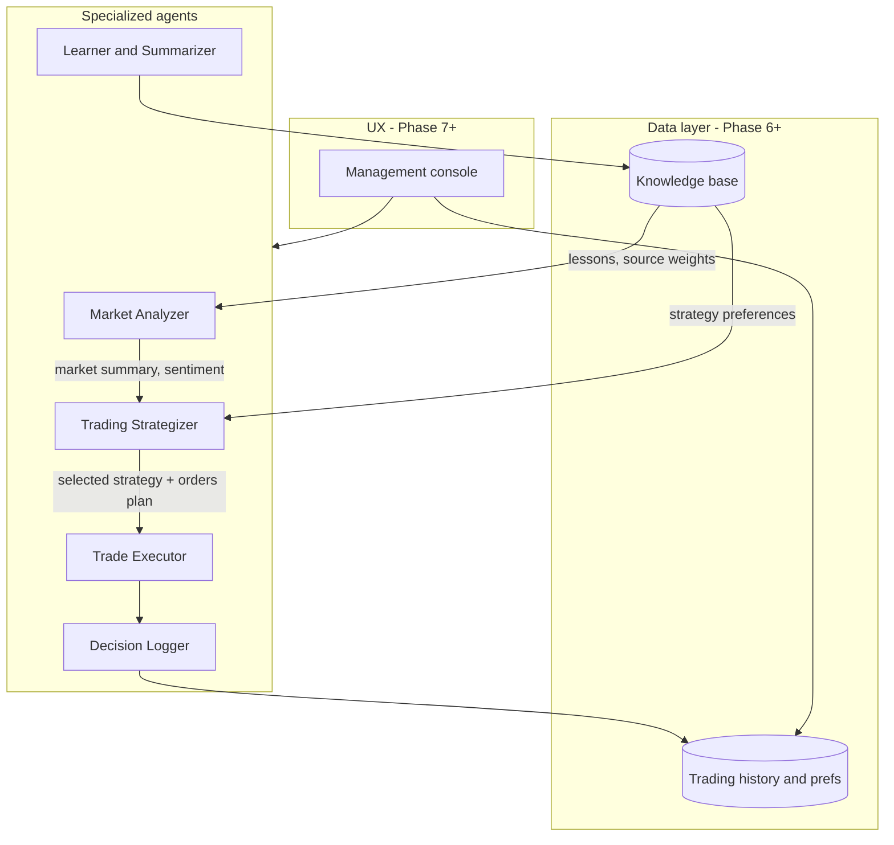

# Trading Agent — Project Plan

Last updated: 2026-07-11

## Overview

An **LLM-orchestrated trading platform** that runs periodic cycles: gather market intelligence → formulate strategies → execute trades → log outcomes → learn over time. Today the codebase is a **single monolithic trading agent** (Phase 1 MVP). The roadmap evolves it into a **multi-agent system** with persistence, management UX, and multi-tenant user support.

### Current architecture (Phase 1.5 — layered pipeline)

**Update this diagram** when changing the trading pipeline (see `docs/agents/development.md`).

### Target architecture (Phase 4+)

---

## Phase status

| Phase | Status | Summary |
|-------|--------|---------|
| **Phase 1** — Paper-trading MVP | **Done** | E2E cycle, env config, JSON decisions, artifacts, tests |
| **Phase 1.5** — Valid trades + layered architecture | **Done** | Domain models, all-analysis runner, trade preparation, enriched portfolio |
| **Phase 2** — Richer market context | Planned | News, real indicators, deeper market data in prompts |
| **Phase 3** — Backtesting | Planned | Historical replay, strategy comparison metrics |
| **Phase 4** — Multi-agent architecture | Planned | Analyzer, strategizer, executor, logger, learner |
| **Phase 5** — Multi-broker | Planned | `BrokerClient` abstraction beyond Alpaca |
| **Phase 6** — Data persistence | Planned | DB for prefs, history, confirmations, knowledge base |
| **Phase 7** — Manageability UX | Planned | Console for agents, LLM config, activity and history |
| **Phase 8** — Sign up & authentication | Planned | Registration, sign-in, user-scoped experience |
| **Phase 9** — Multi-customer isolation | Planned | Strict per-user data boundaries; no cross-user influence |
| **Phase 10** — Production hardening | Planned | Secrets, risk guardrails, observability, scale |

---

## Phase 1: Paper-trading MVP — COMPLETE

**Goal:** One complete paper-trading cycle with real Alpaca data + configurable LLM, producing a readable artifact.

### Delivered

- **Config** — `trading_agent/config.py`, `.env.example` (`LLM_PROVIDER`, `LLM_MODEL`, `TRADING_CYCLE_INTERVAL`, Alpaca keys)
- **Reliable LLM loop** — JSON decision parsing in `trading_agent/models.py`; empty decisions = HOLD
- **Market context in prompts** — `format_market_conditions()` fed into analysis and strategy
- **Dependency injection** — `TradingAgent` accepts injected `alpaca_client`
- **MVP entry point** — `run_agent.py`: validate config, run cycle, save `logs/cycle_*.json`, print summary with trade **Details** column
- **Gemini defaults** — migrated from deprecated `gemini-2.0-flash` to `gemini-3.1-flash-lite-preview`; `scripts/verify_gemini_setup.py`
- **Tests** — decision parsing, trading cycle integration (mock LLM/Alpaca), trade failure formatting, scheduler (10 tests)
- **Deploy/docs touch** — `docker-compose.yml` Dockerfile path, README MVP section

### Known follow-ups (post-merge) — addressed in Phase 1.5

- ~~**Pre-trade validation**~~ — `TradePreparer` + `TradeValidator` clip/skip before broker submit
- ~~**Dedupe decisions**~~ — `TradeConsolidator` merges strategy + rebalancer orders
- **Rebalancing order parsing** — LLM sometimes outputs non-numeric qty (still possible)
- **Finnhub live integration** — stub provider; wire when `FINNHUB_API_KEY` is configured

---

## Phase 2: Richer Market Context

**Goal:** Ground LLM decisions in real, recent market signals. Feeds the future **Market Analyzer** agent (Phase 4).

| Work item | Approach |
|-----------|----------|
| Deeper market data in prompts | Index prices, SMA trend, volatility, sector ETFs (XLK, XLV, …) |
| News / sentiment | `NewsDataProvider` ABC; first impl via Finnhub, Alpha Vantage, or RSS + summarization |
| Real technical indicators | Compute RSI/MACD in Python; inject into `TechnicalAnalysisStrategy` |
| Fundamentals (later) | Earnings, PE via Financial Modeling Prep or similar |
| Extensible signal plugins | Each signal source as a pluggable module the analyzer can aggregate |

---

## Phase 3: Backtesting Mode

**Goal:** Evaluate strategies on historical data. Required input for the **Trading Strategizer** (Phase 4) to compare trade-offs.

- New package: `trading_agent/backtest/`
  - `BacktestEngine` — replay dates, feed historical bars
  - `BacktestBroker` — simulate fills
  - `BacktestResult` — PnL, drawdown, Sharpe, trade log
- Support LLM strategy (spot checks) and at least one rules-based `TradingStrategy` for fast iteration
- **Strategy comparison API** — run multiple strategy variants; return ranked metrics for strategizer agent
- CLI: `python -m trading_agent.backtest --strategy … --start … --end …`

---

## Phase 4: Multi-Agent Architecture

**Goal:** Replace the monolithic `TradingAgent` with specialized agents that collaborate on each cycle. Each agent has a clear contract, can use its own LLM prompt/model, and can be extended independently.

### Agents

| Agent | Role | Inputs | Outputs |
|-------|------|--------|---------|
| **Market Analyzer** | Synthesize market picture from many signals | Price data, news, sentiment, indicators, sector trends (extensible) | Structured **market summary**: trend, sentiment, risks, key themes |
| **Trading Strategizer** | Propose and compare strategies | Market summary, portfolio state, backtest results, lessons from knowledge base | 2–N **strategy options** with trade-offs; **selected strategy** with rationale |
| **Trade Executor** | Turn strategy into orders and execute | Selected strategy, account/positions, risk rules | Concrete orders; broker responses; execution report |
| **Decision Logger** | Record everything for audit and learning | All agent inputs/outputs, orders, fills | Append-only **decision log** per cycle (feeds Phase 6 persistence) |
| **Learner & Summarizer** | Reflect on outcomes over time | Historical logs, PnL, win/loss patterns | **Lessons learned** in knowledge base; suggested weight tweaks for signals and strategies |

### Orchestration

- **Cycle coordinator** — replaces or wraps `TradingCycle`; invokes agents in order, passes structured payloads (not raw LLM text)
- **Agent registry** — configure which agents run, their LLM models, and enable/disable signal sources
- **Feedback loop** — Learner updates knowledge base → Market Analyzer adjusts source weights → Strategizer adjusts strategy preferences

### Migration path from Phase 1

| Today | Becomes |
|-------|---------|
| `trading_agent/analysis/*` | Market Analyzer (initial impl) |
| `GeneralTradingStrategy` + rebalancer | Trading Strategizer (initial impl) |
| `trader.execute_trades()` | Trade Executor |
| `logs/cycle_*.json` | Decision Logger (structured schema) |
| (none) | Learner & Summarizer (new) |

### Deliverables

- Agent ABC + message schemas (Pydantic/dataclasses)
- Coordinator pipeline with mock agents for tests
- Per-agent prompts isolated under e.g. `trading_agent/agents/`
- End-to-end paper cycle through all five agents

---

## Phase 5: Multi-Broker Support

**Goal:** Abstract broker behind an interface; Alpaca is one implementation. Used by **Trade Executor**.

- Introduce `BrokerClient` ABC (`get_account`, `get_positions`, `place_market_order`, …)
- Refactor `alpaca_client.py` to implement it; keep `mock_alpaca_client.py` as test double
- Add a second broker only when there is a concrete use case (IB, Schwab, etc.)
- Executor agent selects broker from user/config without changing strategizer or analyzer

---

## Phase 6: Data Persistence

**Goal:** Move from file-based logs to durable storage for everything the platform needs to remember.

| Domain | Stored data |
|--------|-------------|
| **User preferences** | Risk tolerance, LLM provider/model per agent, enabled signal sources, strategy preferences |
| **Confirmations** | User approvals for trades, strategy selections, config changes |
| **Trading history** | Cycles, decisions, orders, fills, PnL snapshots |
| **Agent knowledge base** | Lessons learned, source weight history, strategy performance notes |
| **Activity log** | Agent runs, errors, latency, token usage |

### Approach

- Start local: **SQLite** or **PostgreSQL** with clear schema per domain
- Production: managed RDS / DynamoDB + S3 for large artifacts
- Replace `logs/cycle_*.json` as source of truth; files become optional export
- APIs for agents and UX to read/write scoped records (user_id added in Phase 9)

---

## Phase 7: Manageability UX

**Goal:** Web (or desktop) console to operate the platform without editing `.env` or reading raw JSON logs.

| Area | Features |
|------|----------|
| **Agent management** | Enable/disable agents; view agent config; trigger manual cycle |
| **LLM configuration** | Per-agent provider, model, temperature; test prompt |
| **Preferences** | Risk settings, watchlists, strategy defaults |
| **Activity & history** | Cycle timeline, decision drill-down, trade outcomes, failure details |
| **Knowledge base viewer** | Browse lessons learned; see what the learner fed back to agents |

### Approach

- API layer (FastAPI or similar) over Phase 6 persistence + agent coordinator
- Frontend: simple React/Vue dashboard (or extend existing tooling)
- Auth-gated (Phase 8); all views scoped to signed-in user

---

## Phase 8: Sign Up & Authentication

**Goal:** Users can register, sign in, and see only their own trading world.

| Work item | Approach |
|-----------|----------|
| Registration | Email/password or OAuth (Google, GitHub); email verification optional |
| Sign in / session | JWT or session cookies; secure password storage |
| Signed-in UX | All Phase 7 screens show user name, portfolio, cycles, and prefs for **this user only** |
| Broker credentials | Per-user encrypted storage of Alpaca/API keys (not shared) |
| Onboarding | First-run flow: connect paper account, set preferences, run first cycle |

Builds on Phase 6 (user record in DB) and Phase 7 (authenticated UI routes).

---

## Phase 9: Multi-Customer Isolation

**Goal:** Multiple independent users on one deployment with **strict isolation** — no data leakage and no cross-user influence on trading decisions.

| Requirement | Implementation |
|-------------|----------------|
| Data isolation | Every row keyed by `user_id`; queries always filtered; no shared knowledge base across users |
| Agent run isolation | Each cycle runs in user context only (portfolio, prefs, history, lessons) |
| No cross-user learning | Learner agent writes/reads knowledge **per user**; optional platform-wide anonymized aggregates only if explicitly designed |
| Resource limits | Per-user rate limits on LLM and broker API calls |
| Testing | Integration tests prove user A cannot read or affect user B's cycles |

Depends on Phase 6 (persistence), Phase 8 (auth identity). Required before any shared/hosted production offering.

---

## Phase 10: Production Hardening

Lower priority until multi-agent + persistence + auth are proven in paper trading:

- ECS secrets / task env vars (no `.env` baked into image)
- CI deploy only on `main`; pin image by SHA
- Pre-trade risk guardrails in code (position limits, daily loss, symbol whitelist)
- Limit/stop/bracket orders; order status polling
- CloudWatch alarms and health checks
- Broader test coverage; load testing for multi-tenant API
- Compliance hooks (audit export, retention policies)

---

## Recommended execution order

1. ~~Phase 1 MVP~~ ✓
2. **Phase 2** — richer market context (feeds Market Analyzer)
3. **Phase 1 follow-ups** — pre-trade validation, dedupe (small PRs alongside Phase 2)
4. **Phase 3** — backtesting (required before strategizer can compare strategies)
5. **Phase 4** — multi-agent architecture (core platform evolution)
6. **Phase 5** — multi-broker (when Trade Executor needs more than Alpaca)
7. **Phase 6** — data persistence (before UX and multi-user)
8. **Phase 7** — manageability UX
9. **Phase 8** — sign up & authentication
10. **Phase 9** — multi-customer isolation (harden before hosted launch)
11. **Phase 10** — production hardening before live money at scale

---

## Key paths (quick reference)

| Area | Path |
|------|------|
| Single-cycle entry | `run_agent.py` |
| Scheduled service | `trading_service.py` → `scheduler/scheduler.py` |
| Cycle wrapper | `agent/trading_cycle.py` |
| Core orchestrator (today) | `trader.py` (`TradingAgent`) |
| Config | `trading_agent/config.py` |
| Models / parsing | `trading_agent/models.py` |
| LLM clients | `trading_agent/llm/` |
| Strategies | `trading_agent/strategies/` |
| Market data | `trading_agent/market_data/` |
| Broker | `alpaca_client.py` |
| Tests | `tests/` |
| Agent docs | `docs/agents/` |
| Future multi-agent package | `trading_agent/agents/` (Phase 4) |
