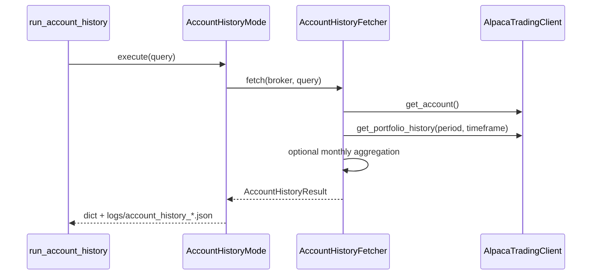

# Account history mode

Read-only mode that fetches your Alpaca **account snapshot** and **portfolio equity history**. It does not call the LLM or place trades.

## Entry point

| Script | Behavior |
|--------|----------|
| `run_account_history.py` | One fetch; saves artifact; prints summary |

Delegates to `trading_agent/orchestrator/account_history.py` → `AccountHistoryFetcher`.

## When to use

- Track **total assets** (`equity`) over time — not cash alone
- Understand **margin debt** when cash is negative
- Review **monthly equity changes** over the past year

Alpaca accounts are margin accounts by default. Negative cash means borrowed funds; **equity** is the net worth number to watch.

## Run locally

Requires only Alpaca credentials (`ALPACA_API_KEY`, `ALPACA_SECRET_KEY`). No LLM API key needed.

```bash
# Last month (default)
.venv/bin/python run_account_history.py

# Past year, monthly breakdown
.venv/bin/python run_account_history.py --period 1A --group-by month

# Same as above; 1Y and --timeframe 1M are accepted aliases
.venv/bin/python run_account_history.py --period 1Y --timeframe 1M
```

### CLI options

| Flag | Description |
|------|-------------|
| `--period` | History window: `1D`, `1W`, `1M`, `3M`, `1A` (or `1Y` alias) |
| `--timeframe` | Alpaca bar size: `1Min`, `5Min`, `15Min`, `1H`, `1D` only |
| `--group-by month` | Aggregate daily equity into end-of-month points |
| `--date-end` | End date `YYYY-MM-DD` (default: current market date) |
| `--extended-hours` | Include extended hours for intraday timeframes |

**Note:** `--timeframe 1M` is **not** a valid Alpaca bar size. The CLI interprets it as a request for monthly grouping (fetches `1D` bars, then aggregates).

## Sequence



## Result shape

Successful fetches return:

- `status`: `"success"` or `"error"`
- `snapshot`: current account (`equity`, `cash`, `margin_debt`, `long_market_value`, …)
- `history`: list of `{timestamp, equity, profit_loss, profit_loss_pct}`
- `query`: requested `period`, `timeframe`, `group_by`, …
- `period_change`, `period_change_pct`: equity change over the window
- `group_by`: `"month"` when monthly aggregation was applied

Artifacts are written to `logs/account_history_<timestamp>.json`.

## Module layout

| Path | Role |
|------|------|
| `trading_agent/domain/account/` | `AccountSnapshot`, `AccountHistoryPoint`, `AccountHistoryResult` |
| `trading_agent/account/history_fetcher.py` | Fetches and parses broker data |
| `trading_agent/account/query_resolver.py` | Normalizes CLI params (`1Y` → `1A`, `1M` → group-by month) |
| `trading_agent/account/aggregation.py` | Monthly rollup from daily points |
| `trading_agent/orchestrator/account_history.py` | Read-only orchestrator |
| `trading_agent/broker/alpaca_client.py` | `get_portfolio_history()` wrapper |
| `trading_agent/tests/test_account_history.py` | Unit tests (mock Alpaca) |

## Safe places to change behavior

- **Query normalization** — `trading_agent/account/query_resolver.py`
- **Aggregation** — `trading_agent/account/aggregation.py`
- **Snapshot fields** — `trading_agent/domain/account/account_history.py`
- **Summary output** — `run_account_history.py`

## Tests

```bash
.venv/bin/python -m unittest trading_agent.tests.test_account_history -v
```
