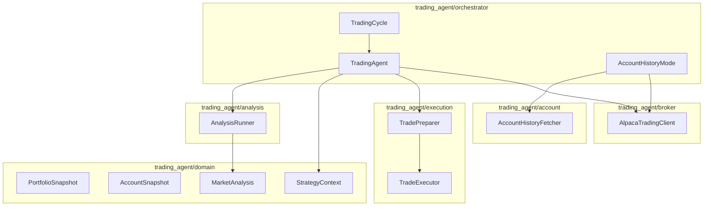

# Codebase overview

## What this project does

LLM-driven **paper trading** on Alpaca, plus a separate **account history** mode for read-only portfolio tracking.

### Trading cycle

Each cycle:

1. Fetch market conditions + portfolio snapshot (buying power, positions, open orders)
2. Collect market signals (Alpaca bars/indices/sectors + Finnhub news + FMP fundamentals)
3. Run **all three** analysis strategies (general, technical, fundamental) via `AnalysisRunner`
4. Build `StrategyContext` and run trading strategy + optional rebalancer
5. **Prepare trades** — consolidate, validate, clip, order SELLs before BUYs
6. Execute via `TradeExecutor` and save `logs/cycle_*.json`

### Account history mode

Separate from the trading cycle — no LLM, no orders:

1. Fetch current account snapshot (`equity`, `cash`, margin fields)
2. Fetch portfolio equity history from Alpaca (`get_portfolio_history`)
3. Optionally aggregate daily bars to monthly end-of-month equity
4. Save `logs/account_history_*.json`

See **[account-history.md](account-history.md)** for CLI usage and module layout.

## Architecture (layers → directories)



**Keep this diagram in sync** with `docs/PROJECT_PLAN.md` when changing the pipeline.

## Directory layout

```
trading-agent/
├── data.example/             # Committed JSON templates (one file per future SQL table)
├── run_agent.py
├── run_account_history.py  # read-only account snapshot + equity history
├── trading_service.py
├── trading_agent/
│   ├── broker/               # Alpaca trading client + mock (orders, account, history)
│   ├── domain/               # Typed pipeline models
│   │   ├── signals/          # MarketConditions, MarketSignals
│   │   ├── portfolio/        # PortfolioSnapshot, Position, OpenOrder
│   │   ├── account/          # AccountSnapshot, AccountHistoryResult
│   │   ├── cycle/            # StrategyContext, MarketAnalysis, CycleResult
│   │   └── user/             # UserPreferences, SignalConfig, Watchlist
│   ├── storage/              # JsonFileStore + per-domain stores (→ data/*.json)
│   ├── orchestrator/         # TradingAgent, TradingCycle, AccountHistoryMode
│   ├── scheduler/            # TradingScheduler for trading_service.py
│   ├── account/              # AccountHistoryFetcher, query resolver, aggregation
│   ├── execution/            # SnapshotBuilder, Consolidator, Validator, Preparer, Executor
│   ├── analysis/             # AnalysisRunner + general/technical/fundamental
│   ├── strategies/           # GeneralTradingStrategy
│   ├── portfolio/            # PortfolioRebalancer
│   ├── market_data/          # Alpaca + Finnhub + FMP + historical caches
│   ├── signals/              # SignalAggregator, indicators, sources
│   ├── backtest/             # BacktestEngine, broker, benchmarks, metrics
│   ├── formatters/           # Domain → LLM prompt text
│   ├── models.py             # JSON parsing helpers
│   └── llm/
├── run_backtest.py           # manual historical backtest CLI
├── tests/
└── docs/
```

## Domain models (pipeline contract)

| Model | Package | Role |
|-------|---------|------|
| `MarketConditions` | `domain/signals` | Index trend, volatility, sector ETFs from Alpaca |
| `MarketSignals` | `domain/signals` | Aggregated data/technical/news/fundamental slices |
| `PortfolioSnapshot` | `domain/portfolio` | Account, positions with qty, open orders (trading cycle) |
| `AccountSnapshot` | `domain/account` | Margin-aware account state for history mode |
| `AccountHistoryResult` | `domain/account` | Snapshot + equity time series + period change |
| `MarketAnalysis` | `domain/cycle` | All three `AnalysisResult` entries |
| `StrategyContext` | `domain/cycle` | Single input to `make_trading_decisions` |
| `TradingDecision` | `domain/cycle` | Typed BUY/SELL with source tag |
| `TradePreparationResult` | `domain/cycle` | raw / consolidated / executable / adjusted / skipped |
| `CycleResult` | `domain/cycle` | Top-level artifact |
| `UserPreferences` | `domain/user` | Risk tolerance, goals — `data/preferences.json` |
| `SignalConfig` | `domain/user` | Sector ETFs, enabled sources — `data/signal_config.json` |
| `Watchlist` | `domain/user` | Symbols of interest — `data/watchlist.json` (stored, not yet wired) |

## Important interfaces

| Interface | Location | Implementations |
|-----------|----------|-----------------|
| `LLMClient` | `trading_agent/llm/base.py` | gemini, claude, openai, huggingface, mock |
| `MarketDataProvider` | `trading_agent/market_data/base.py` | alpaca, mock |
| `NewsDataProvider` | `trading_agent/market_data/news_base.py` | finnhub, mock |
| `FundamentalDataProvider` | `trading_agent/market_data/fundamentals_base.py` | fmp, mock |
| `AnalysisStrategy` | `trading_agent/analysis/base.py` | general, technical, fundamental |
| `AnalysisRunner` | `trading_agent/analysis/runner.py` | runs all three per cycle |
| `TradingStrategy` | `trading_agent/strategies/base.py` | general |
| `TradePreparer` | `trading_agent/execution/preparer.py` | consolidate + validate |
| `BrokerClient` | `trading_agent/broker/base.py` | Protocol for broker surface |
| `AlpacaTradingClient` | `trading_agent/broker/alpaca_client.py` | live; `get_portfolio_history()` |
| `MockAlpacaTradingClient` | `trading_agent/broker/mock_client.py` | test double |
| `AccountHistoryFetcher` | `trading_agent/account/history_fetcher.py` | snapshot + equity history from broker |

## Extension points

| Task | Where to change |
|------|-----------------|
| New LLM provider | `trading_agent/llm/` + `get_llm_client()` |
| New analysis strategy | `trading_agent/analysis/` + register in `AnalysisRunner` |
| New data/signal source | `trading_agent/market_data/` + `SignalAggregator`; see [market-signals.md](market-signals.md) |
| Pre-trade rules | `trading_agent/execution/validator.py` |
| Trade consolidation | `trading_agent/execution/consolidator.py` |
| Cycle orchestration | `trading_agent/orchestrator/agent.py` |
| Account history mode | `trading_agent/orchestrator/account_history.py`, `run_account_history.py` |
| Backtesting | `trading_agent/backtest/`, `run_backtest.py`; see [backtesting.md](backtesting.md) |
| Prompt formatting | `trading_agent/formatters/` |
| Decision JSON schema | `trading_agent/models.py`, `GeneralTradingStrategy` |
