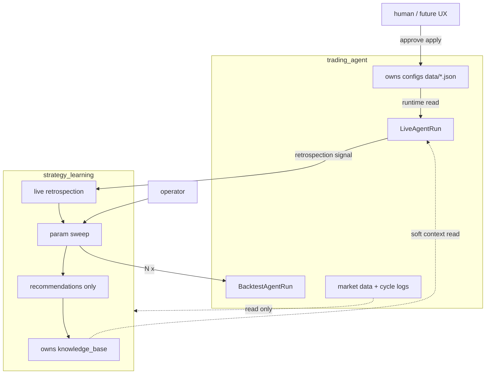
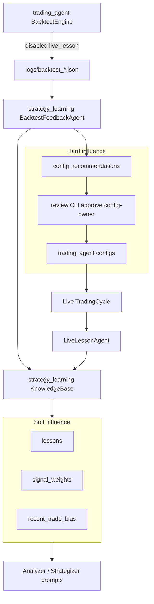

# Learning loop (Phase 4.5)

Closed-loop tuning: backtest / live outcomes → knowledge base → soft prompt context and hard (human-approved) config changes.

See also [multi-agent.md](multi-agent.md), [backtesting.md](backtesting.md), [`strategy_learning/README.md`](../../strategy_learning/README.md), and [PROJECT_PLAN.md](../PROJECT_PLAN.md).

## Status

| Piece | Status |
|-------|--------|
| Phase A — learner isolation + prompt wiring | **Done** |
| Phase B — KB schema v2 + backtest feedback + review CLI | **Done** |
| **4.5.1** — `strategy_learning` scaffold + architecture docs | **Done** |
| **4.5.2** — Live vs Backtest agent-run modes | **Done** |
| **4.5.3** — KB / data boundary into `strategy_learning` | **Done** |
| **4.5.4** — Param sweep (sole recommendation path) | **Done** |
| **4.5.5** — Live retrospection → sweep | **Done** |
| Phase 6 / 7 — DB persistence + UX | Later |
| Phase 11 — Strategy learning as separate service | Planned |

Phase 5 (multi-broker) is **Done** — see [multi-broker.md](multi-broker.md).

## Target package and data boundary



| Data | Owner | Rule |
|------|-------|------|
| Knowledge base + recommendations | **`strategy_learning`** | Learning writes; trading_agent reads soft context for prompts |
| Configs | **`trading_agent`** | Runtime reads; apply/approve is config-owner — **not** strategy_learning |
| Market data / decisions | **`trading_agent`** | strategy_learning reads only |

**Circular-trigger rule (4.5.2 — enforced):** only live runs may invoke retrospection/sweep. Encoded on `LiveAgentRun` / `BacktestAgentRun` in `trading_agent/orchestrator/agent_run.py`. Deploy uses live mode only.

## Architecture (runtime — after 4.5.3)



### Soft vs hard

- **Soft** — lessons, `signal_weights`, `recent_trade_bias` appear in LLM prompts. Probabilistic. `recent_trade_bias` is KB-only (never written to `strategy_params.json`). Active config keys win over KB prefs on conflict (`{**kb_prefs, **strategy_params}`).
- **Hard** — `config_recommendations` with `pending_review`; only `--approve` writes `data/*.json`. Default is human-in-the-loop. Hard recommendations come from **param sweep only** (`run_sweep.py`).

### Backtest vs live

| | Backtest | Live |
|--|----------|------|
| During replay | `LiveLessonAgent` **disabled** | N/A |
| After run | `BacktestFeedbackAgent` writes validation + optional recommendation | Per-cycle lesson + bias nudge via `LiveLessonAgent` |
| Same store | `data/knowledge_base.json` with `source: backtest \| live` | same |

## Knowledge base schema v2

Document shape (see `data.example/knowledge_base.json`):

- `schema_version`, `user_id`, `derived_state` (weights, prefs, active recommendation pointer)
- Append-heavy arrays: `lessons`, `backtest_validations`, `config_recommendations`, `promotions`
- **Immutable** on recommendations: summary, rationale, provenance, proposed_changes
- **Mutable**: `status`, `review.*`, `superseded_by`
- v1 files migrate on load (string lessons → `LessonRecord`)

### EventRef provenance

Hard-influence writes require a resolvable EventRef (`backtest_run`, `trading_cycle`, or `sweep`) with `event_id` and preferably `artifact_path`. Validated in `KnowledgeBase` write paths.

### Lesson selection for prompts

Last 5 `source=backtest` + last 5 `source=live` summaries, deduped, max 10 (`lessons_for_prompt`).

### Signal weights

Updated only by **BacktestFeedback** with capped deltas (±0.1, clamped to [0.5, 1.5]) when underperformance vs SPY is detected. Live lesson agent does **not** invent weight updates. If attribution is weak, weights stay near defaults — do not treat empty weights as “learned.”

## Operator workflow

```bash
# Run backtest then score into KB (validations / soft weights — not hard recs)
.venv/bin/python run_backtest.py --start 2024-01-01 --end 2024-06-30 --feedback

# Or feedback on an existing artifact
.venv/bin/python run_backtest.py --feedback logs/backtest_....json

# Param sweep → pending hard recommendation (sole hard-rec path)
# Default is sequential (--max-workers 1). Overlap candidates with e.g. --max-workers 2.
.venv/bin/python run_sweep.py --start 2024-01-01 --end 2024-06-30 --write-kb
.venv/bin/python run_sweep.py --start 2024-01-01 --end 2024-06-30 --write-kb --max-workers 2

# After a live underperformance trigger (logs/retrospection_*.json):
.venv/bin/python run_retrospection.py --list
.venv/bin/python run_retrospection.py --write-kb
# Or dry-run / explicit path:
.venv/bin/python run_retrospection.py --dry-run
.venv/bin/python run_retrospection.py --trigger logs/retrospection_....json --write-kb

# Pending?
.venv/bin/python scripts/review_config_recommendation.py --status

# Diff
.venv/bin/python scripts/review_config_recommendation.py

# Lineage
.venv/bin/python scripts/kb_lineage.py --recommendation-id cr-...

# Approve (optional walk-forward gate)
.venv/bin/python scripts/review_config_recommendation.py --approve \
  --require-validate-window --validate-artifact logs/backtest_holdout.json

# Reject
.venv/bin/python scripts/review_config_recommendation.py --reject --reason "drawdown"
```

Promotion audits land in `logs/config_promotions_<timestamp>.json`.

### Walk-forward gate

Promoting on a single window overfits. `--require-validate-window` blocks approve unless a held-out backtest artifact has `status=success`. Pass `--validate-artifact` to `run_sweep.py` to attach held-out evidence; use the review flag before live promotion.

### Proposed change caps

Sweep may propose only whitelisted discrete steps: `risk_management`, `position_sizing`, `timeframe`, `max_position_size`, rebalance `threshold`, `risk_tolerance`. One pending recommendation at a time (older pending → `superseded`).

## Live underperformance trigger (4.5.5)

After each successful live cycle, `TradingCycle` evaluates underperformance and may emit a durable signal (`logs/retrospection_*.json`). Sweep runs **out-of-band** via `run_retrospection.py` — never inside the trading cycle.

v1 trigger rules (either):

- Rolling **30d** portfolio equity return lags SPY by more than `RETROSPECTION_SPY_LAG_PP` (default **0.05** / 5 pp), **or**
- **`RETROSPECTION_HOLD_STREAK`** (default **3**) consecutive successful cycles with `hold=true` while SPY rises over that span

Cooldown: skip new triggers while a pending signal exists, or within `RETROSPECTION_COOLDOWN_DAYS` (default **7**) of the last trigger.

Must **not** rewrite `data/*.json`; emit trigger → `run_retrospection.py` → sweep → human promote via config-owner path. Only from **live** runs (`LiveAgentRun.emit_retrospection_signal`). Retrospection failures are logged and never fail the cycle.

## Audit: lessons on cycle artifacts

Pipeline order stays logger → live_lesson. `LiveLessonAgent` **patches** `agents.lessons_update` onto the cycle JSON so EventRefs to `logs/cycle_*.json` include what was learned.

Backtest `cycle_summaries[]` include `cycle_id` for lineage into parent `logs/backtest_*.json`.

## Key modules

| Module | Role |
|--------|------|
| `strategy_learning/knowledge/store.py` | KB v2 load/save/migrate |
| `strategy_learning/knowledge/records.py` | EventRef, migration, trim, enums |
| `strategy_learning/knowledge/feedback.py` | Score run → validation / soft weights (no hard recs) |
| `strategy_learning/sweep/` | OAT param sweep → `SweepResult` + hard recommendations |
| `run_sweep.py` | Operator CLI for param sweep |
| `strategy_learning/retrospection/` | Live underperf detector + durable signal I/O |
| `run_retrospection.py` | Consume retrospection triggers → out-of-band sweep |
| `trading_agent/orchestrator/agent_run.py` | `LiveAgentRun` / `BacktestAgentRun`; circular-trigger guard |
| `trading_agent/agents/live_lesson.py` | Live cycle lessons + artifact patch |
| `trading_agent/agents/promotion.py` | Approve / reject / defer (config-owner side) |
| `trading_agent/formatters/knowledge.py` | Prompt blocks |
| `scripts/review_config_recommendation.py` | Operator CLI |
| `scripts/kb_lineage.py` | Audit chain |

## Tests

**Coverage rule for this flow:** changing retrospection / sweep / KB must update tests for each layer touched (metrics → detector → signal → cycle hook → CLI). See [development.md § Test coverage by flow](development.md#test-coverage-by-flow).

- `strategy_learning/tests/test_scaffold.py` — package exports
- `strategy_learning/tests/test_knowledge.py` — store / schema / EventRef
- `strategy_learning/tests/test_feedback.py` — feedback → validation/weights; configs unchanged
- `strategy_learning/tests/test_boundary.py` — learning must not import config apply paths
- `strategy_learning/tests/test_sweep_candidates.py` — OAT expansion
- `strategy_learning/tests/test_sweep_runner.py` — mock sweep → pending rec with EventRef sweep
- `strategy_learning/tests/test_retrospection_metrics.py` — lag vs SPY, hold-streak
- `strategy_learning/tests/test_retrospection_detector.py` — trigger / cooldown skips
- `strategy_learning/tests/test_retrospection_signal.py` — write / consume durable signals
- `strategy_learning/tests/test_run_retrospection_cli.py` — `--list` / `--dry-run` / consume (mock sweep) + short window
- `trading_agent/tests/test_retrospection_cycle_hook.py` — `TradingCycle._maybe_emit_retrospection` emit / skip / never-fail
- `trading_agent/tests/test_agent_run_modes.py` — Live/Backtest run modes + emit / circular-trigger guard
- `tests/test_learning_prompts.py` — prompt inclusion, live_lesson disabled in backtest, artifact patch
- `tests/test_learning_loop.py` — promotion reject / walk-forward gate

### One-time local verification (PR checklist)

After CI unit tests are green, confirm once locally (paper / mock as available):

- [ ] Live cycle: `.venv/bin/python run_agent.py` — completes; KB gains a live lesson; configs not silently rewritten
- [ ] Backtest: `.venv/bin/python run_backtest.py --start … --end …` — completes; `live_lesson` disabled; optional `--feedback` writes KB only
- [ ] Sweep: `.venv/bin/python run_sweep.py --start … --end … --write-kb` — writes `logs/sweep_*.json`; pending rec only if a candidate beats baseline (use a short window for sanity, e.g. ~1 week + few symbols)
- [ ] Retrospection: after a trigger exists, `.venv/bin/python run_retrospection.py --list` then `--dry-run --start YYYY-MM-DD --end YYYY-MM-DD --symbols AAPL` (short window); optional real consume / `--write-kb` — mock consume is the CI bar
