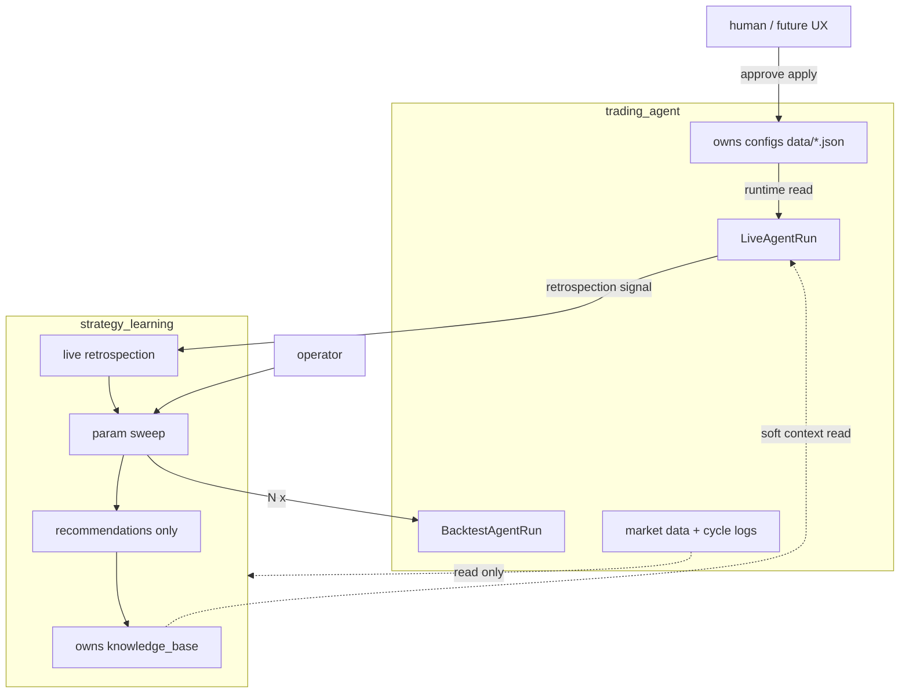
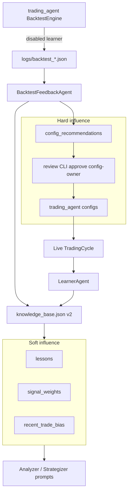

# Learning loop (Phase 4.5)

Closed-loop tuning: backtest / live outcomes → knowledge base → soft prompt context and hard (human-approved) config changes.

See also [multi-agent.md](multi-agent.md), [backtesting.md](backtesting.md), [`strategy_learning/README.md`](../../strategy_learning/README.md), and [PROJECT_PLAN.md](../PROJECT_PLAN.md).

## Status

| Piece | Status |
|-------|--------|
| Phase A — learner isolation + prompt wiring | **Done** |
| Phase B — KB schema v2 + backtest feedback + review CLI | **Done** |
| **4.5.1** — `strategy_learning` scaffold + architecture docs | **Done** |
| **4.5.2** — Live vs Backtest agent-run modes | **Done** |
| **4.5.3** — KB / data boundary into `strategy_learning` | Planned |
| **4.5.4** — Param sweep (sole recommendation path) | Planned |
| **4.5.5** — Live retrospection → sweep | Planned |
| Phase 6 / 7 — DB persistence + UX | Later |
| Phase 11 — strategy learning as separate service | Planned |

Phase 5 (multi-broker) is **Done** — see [multi-broker.md](multi-broker.md).

## Target package and data boundary



| Data | Owner | Rule |
|------|-------|------|
| Knowledge base + recommendations | **`strategy_learning`** (target) | Learning writes; trading_agent reads soft context for prompts |
| Configs | **`trading_agent`** | Runtime reads; apply/approve is config-owner — **not** strategy_learning |
| Market data / decisions | **`trading_agent`** | strategy_learning reads only |

Today (through 4.5.2) KB / feedback / promotion still live under `trading_agent/agents/`. The [`strategy_learning/`](../../strategy_learning/) package is a scaffold for 4.5.3+.

**Circular-trigger rule (4.5.2 — enforced):** only live runs may invoke retrospection/sweep. Encoded on `LiveAgentRun` / `BacktestAgentRun` in `trading_agent/orchestrator/agent_run.py`. Deploy uses live mode only.

## Architecture (current runtime — A/B)

Still implemented under `trading_agent/agents/` until 4.5.3+ moves KB/recs into `strategy_learning`. Soft context is read by live prompts; hard apply stays config-owner (`data/*.json`).



### Soft vs hard

- **Soft** — lessons, `signal_weights`, `recent_trade_bias` appear in LLM prompts. Probabilistic. `recent_trade_bias` is KB-only (never written to `strategy_params.json`). Active config keys win over KB prefs on conflict (`{**kb_prefs, **strategy_params}`).
- **Hard** — `config_recommendations` with `pending_review`; only `--approve` writes `data/*.json`. Default is human-in-the-loop. (After 4.5.4, recommendations come from **sweep only**.)

### Backtest vs live

| | Backtest | Live |
|--|----------|------|
| During replay | Learner **disabled** | N/A |
| After run | `BacktestFeedbackAgent` writes validation + optional recommendation | Per-cycle `LessonRecord` + bias nudge |
| Same store | `data/knowledge_base.json` with `source: backtest \| live` | same |

## Knowledge base schema v2

Document shape (see `data.example/knowledge_base.json`):

- `schema_version`, `user_id`, `derived_state` (weights, prefs, active recommendation pointer)
- Append-heavy arrays: `lessons`, `backtest_validations`, `config_recommendations`, `promotions`
- **Immutable** on recommendations: summary, rationale, provenance, proposed_changes
- **Mutable**: `status`, `review.*`, `superseded_by`
- v1 files migrate on load (string lessons → `LessonRecord`)

### EventRef provenance

Hard-influence writes require a resolvable EventRef (`backtest_run`, `trading_cycle`, or `sweep`) with `event_id` and preferably `artifact_path`. Validated in `KnowledgeBase` write paths.

### Lesson selection for prompts

Last 5 `source=backtest` + last 5 `source=live` summaries, deduped, max 10 (`lessons_for_prompt`).

### Signal weights

Updated only by **BacktestFeedback** with capped deltas (±0.1, clamped to [0.5, 1.5]) when underperformance vs SPY is detected. Live learner does **not** invent weight updates. If attribution is weak, weights stay near defaults — do not treat empty weights as “learned.”

## Operator workflow

```bash
# Run backtest then score into KB
.venv/bin/python run_backtest.py --start 2024-01-01 --end 2024-06-30 --feedback

# Or feedback on an existing artifact
.venv/bin/python run_backtest.py --feedback logs/backtest_....json

# Pending?
.venv/bin/python scripts/review_config_recommendation.py --status

# Diff
.venv/bin/python scripts/review_config_recommendation.py

# Lineage
.venv/bin/python scripts/kb_lineage.py --recommendation-id cr-...

# Approve (optional walk-forward gate)
.venv/bin/python scripts/review_config_recommendation.py --approve \
  --require-validate-window --validate-artifact logs/backtest_holdout.json

# Reject
.venv/bin/python scripts/review_config_recommendation.py --reject --reason "drawdown"
```

Promotion audits land in `logs/config_promotions_<timestamp>.json`.

### Walk-forward gate

Promoting on a single window overfits. `--require-validate-window` blocks approve unless a held-out backtest artifact has `status=success`. Full sweep CLI lands in 4.5.4; use this flag before live promotion.

### Proposed change caps

Feedback may change only whitelisted discrete steps: `risk_management`, `position_sizing`, `timeframe`, `max_position_size`, rebalance `threshold`. One pending recommendation at a time (older pending → `superseded`).

## Live underperformance trigger (4.5.5 — planned)

v1 definition when implemented:

- Rolling 30d equity return lags SPY by more than a configured threshold, **or**
- 3 consecutive successful cycles with `hold=true` while SPY rises over the same span

Must **not** rewrite `data/*.json`; emit a trigger → sweep → human promote via config-owner path. Only from **live** runs.

## Audit: lessons on cycle artifacts

Pipeline order stays logger → learner. Learner **patches** `agents.lessons_update` onto the cycle JSON so EventRefs to `logs/cycle_*.json` include what was learned.

Backtest `cycle_summaries[]` include `cycle_id` for lineage into parent `logs/backtest_*.json`.

## Key modules

| Module | Role |
|--------|------|
| `strategy_learning/` | Package scaffold (4.5.1); KB/sweep/retrospection land in later sub-phases |
| `trading_agent/orchestrator/agent_run.py` | `LiveAgentRun` / `BacktestAgentRun` (4.5.2); circular-trigger guard |
| `trading_agent/agents/knowledge.py` | KB v2 load/save/migrate (**current**; moves in 4.5.3) |
| `trading_agent/agents/kb_records.py` | EventRef, migration, trim, enums |
| `trading_agent/agents/backtest_feedback.py` | Score run → validation / recommendation |
| `trading_agent/agents/promotion.py` | Approve / reject / defer (config-owner side) |
| `trading_agent/agents/learner.py` | Live lessons + artifact patch |
| `trading_agent/formatters/knowledge.py` | Prompt blocks |
| `scripts/review_config_recommendation.py` | Operator CLI |
| `scripts/kb_lineage.py` | Audit chain |

## Tests

- `tests/test_strategy_learning_scaffold.py` — package importable (4.5.1)
- `tests/test_agent_run_modes.py` — Live/Backtest run modes + circular-trigger guard (4.5.2)
- `tests/test_learning_prompts.py` — prompt inclusion, learner disabled in backtest agent, artifact patch
- `tests/test_learning_loop.py` — v2 migration, EventRef rejects, feedback → pending, walk-forward gate, user_id mismatch
