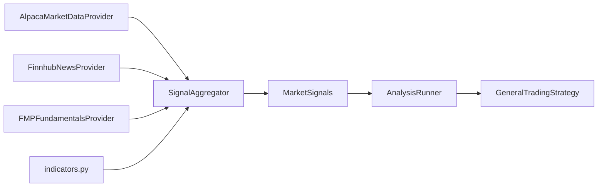

# Market signals (Phase 2)

Phase 2 enriches the trading cycle with structured market signals before LLM analysis runs. Signals are collected by `SignalAggregator` and passed into all three analysis strategies via `AnalysisRunner`.

## Signal slices

| Slice | Source | Key fields |
|-------|--------|------------|
| `market_data` | Alpaca indices + sector ETFs | `indices`, `sector_etfs`, `summary` |
| `technical` | Python indicators from Alpaca bars | `indicators` (RSI, MACD, SMA per symbol), `summary` |
| `news` | Finnhub REST | `headlines`, `sentiment_summary` |
| `fundamentals` | Financial Modeling Prep (FMP) | `metrics` per symbol, `summary` |

Domain models live in `trading_agent/domain/signals/market_signals.py`.

## Data flow



## Environment variables

| Variable | Required? | Purpose |
|----------|-----------|---------|
| `ALPACA_API_KEY` / `ALPACA_SECRET_KEY` | Yes (live cycle) | Bars, indices, sector ETFs |
| `FINNHUB_API_KEY` | No | Company + general news |
| `FMP_API_KEY` | No | P/E, ROE, revenue growth, earnings |
| `FMP_CACHE_ENABLED` | No | File cache for FMP responses (default `true`) |
| `DATA_DIR` | No | Local JSON config store (default `data/`) |

Missing optional keys produce empty slices with an explanatory note in prompts — the cycle does not fail.

## FMP request budget and cache

FMP free tier allows **250 requests/day**. Each trading cycle calls up to `1 + 3 × N` endpoints (`N` = portfolio symbols capped at 5):

| Endpoint | Calls per cycle |
|----------|-----------------|
| `earnings-calendar` | 1 (often 402 on free tier) |
| `ratios-ttm` | 1 per symbol |
| `key-metrics-ttm` | 1 per symbol |
| `financial-growth` | 1 per symbol |

Without caching, a 30-minute scheduler with 5 positions uses ~**768 requests/day**. With the calendar-day file cache, repeat requests the same day are served from disk — typically **~15 live requests/day** for a stable portfolio.

Cache location: `data/cache/fmp/YYYY-MM-DD/{endpoint}__{params}.json`

- Enabled by default (`FMP_CACHE_ENABLED=true`)
- Valid for the same UTC calendar day as `fetched_at`
- Override path with `FMP_CACHE_DIR`
- Set `FMP_CACHE_ENABLED=false` for live integration tests that need fresh data

Sector ETFs tracked are configured in `data/signal_config.json` (seeded from `data.example/signal_config.json`).

## CLI / usage

No new entry point. Signals are collected automatically when running:

```bash
.venv/bin/python run_agent.py
```

Inspect `analysis.signals` in `logs/cycle_*.json` for the populated slices.

## Module layout

```
trading_agent/
├── signals/
│   ├── aggregator.py      # Collects all slices
│   ├── indicators.py      # RSI, MACD, SMA (pandas)
│   └── sources.py         # SignalCollectionContext, sector helpers
├── market_data/
│   ├── alpaca_provider.py # indices, sector ETFs, get_bars()
│   ├── finnhub_provider.py
│   ├── fmp_provider.py
│   ├── fmp_cache.py
│   ├── mock_news_provider.py
│   └── mock_fundamentals_provider.py
└── formatters/
    ├── market_analysis.py  # format_market_signals()
    └── market_conditions.py
```

## Technical indicators

Computed for **SPY** (market benchmark) plus up to **5 portfolio symbols**:

- RSI(14)
- MACD(12, 26, 9) — line, signal, histogram
- SMA(20), SMA(50)

Bars are fetched via `MarketDataProvider.get_bars(symbol, days)` and cached per cycle in the aggregator.

## Sector ETFs

Sector SPDRs are listed in `data/signal_config.json` (default: XLK, XLV, XLF, XLE, XLI, XLY, XLP, XLU, XLB, XLRE). Alpaca fetches each configured ETF.

Each entry includes 5-day return and relative strength vs SPY (`vs_spy_5d`). The market data summary highlights leading and lagging sectors.

## Extending signals

1. **New price-based indicator** — add function in `signals/indicators.py`, call from `SignalAggregator._collect_technical_indicators()`.
2. **New news source** — implement `NewsDataProvider` ABC, inject into `TradingAgent(news_provider=...)`.
3. **New fundamentals source** — implement `FundamentalDataProvider` ABC, inject into `TradingAgent(fundamentals_provider=...)`.
4. **New market data field** — extend `MarketConditions` + `AlpacaMarketDataProvider`, wire in aggregator and formatters.

## Tests

| Test file | Coverage |
|-----------|----------|
| `tests/test_indicators.py` | RSI/MACD/SMA math |
| `tests/test_signal_aggregator.py` | End-to-end aggregation with mocks |
| `tests/test_fmp_provider.py` | FMP provider parsing and stable API |
| `tests/test_fmp_cache.py` | FMP calendar-day file cache |
| `tests/test_storage.py` | JSON file stores and domain models |
| `tests/integration/test_finnhub_live.py` | Live Finnhub (skip without key) |
| `tests/integration/test_fmp_live.py` | Live FMP (skip without key) |

Run all tests:

```bash
.venv/bin/bash scripts/run_tests.sh
```
