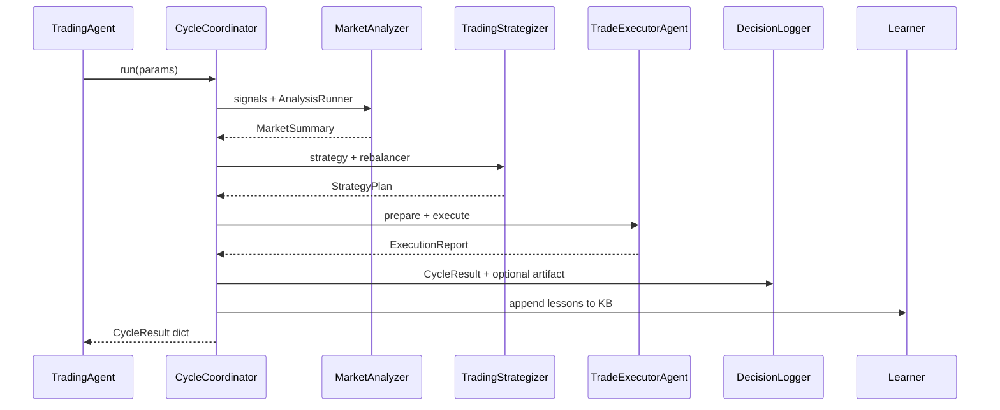

# Multi-agent architecture (Phase 4)

Specialized agents collaborate on each trading cycle. `TradingAgent` remains the public facade (used by `TradingCycle` and backtests) and delegates to `CycleCoordinator`.

## Pipeline



## Package

| Module | Role |
|--------|------|
| `trading_agent/agents/base.py` | Agent ABC |
| `trading_agent/agents/messages.py` | `MarketSummary`, `StrategyPlan`, `ExecutionReport`, `DecisionLog`, `LessonsUpdate` |
| `trading_agent/agents/coordinator.py` | Ordered pipeline |
| `trading_agent/agents/registry.py` | Default agents; enable/disable |
| `trading_agent/agents/knowledge.py` | File KB → `data/knowledge_base.json` |
| `trading_agent/agents/market_analyzer.py` | Wraps `SignalAggregator` + `AnalysisRunner` |
| `trading_agent/agents/strategizer.py` | Wraps `GeneralTradingStrategy` + `PortfolioRebalancer` |
| `trading_agent/agents/executor.py` | Wraps `TradePreparer` + `TradeExecutor` |
| `trading_agent/agents/decision_logger.py` | Builds `CycleResult`; optional `logs/cycle_*.json` |
| `trading_agent/agents/learner.py` | Appends lessons / trade-bias prefs |

## Knowledge base

Template: [`data.example/knowledge_base.json`](../../data.example/knowledge_base.json). Seeded into `data/` on first use (gitignored).

```json
{
  "lessons": [],
  "signal_weights": {},
  "strategy_preferences": {}
}
```

- Analyzer injects recent lessons / weights into `analysis_params` (prompt hints).
- Strategizer merges `strategy_preferences` into strategy params.
- Learner appends one lesson per cycle and nudges `recent_trade_bias`.

## Artifacts

- Live cycles via `TradingCycle` set `write_artifact=True` so Decision Logger writes `logs/cycle_*.json`.
- Backtests keep `write_artifact=False` (default) to avoid flooding `logs/`.
- `run_agent.py` uses the logger path when present; otherwise falls back to `save_cycle_artifact`.

## Extending

1. Implement `Agent.run(ctx)` and register in `build_default_registry`.
2. Prefer wrapping existing analysis/strategy/execution modules over reimplementing them.
3. Keep `CycleResult.to_dict()` keys stable for entry points and tests.
4. Disable agents in tests with `disabled=["learner"]` (or inject a custom `AgentRegistry`).
