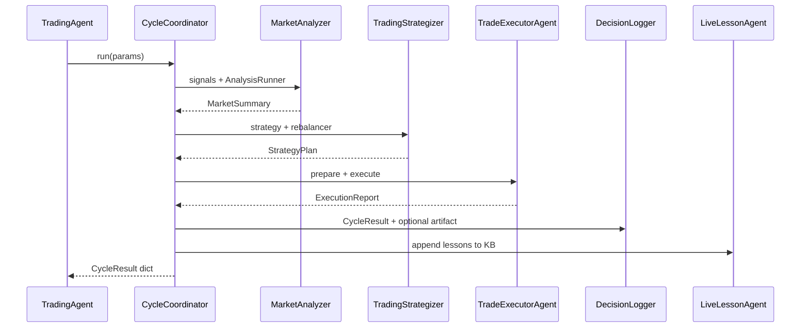

# Multi-agent architecture (Phase 4)

Specialized agents collaborate on each trading cycle. `TradingAgent` remains the shared cycle-engine facade. Phase 4.5.2 wraps it with explicit `LiveAgentRun` / `BacktestAgentRun` modes (`trading_agent/orchestrator/agent_run.py`): live enables `LiveLessonAgent` and may emit retrospection signals; backtest disables live lessons and rejects retrospection.

KB ownership lives in [`strategy_learning`](../../strategy_learning/) (Phase 4.5.3) — see [learning-loop.md](learning-loop.md).

## Pipeline

## Package

| Module | Role |
|--------|------|
| `trading_agent/agents/base.py` | Agent ABC |
| `trading_agent/agents/messages.py` | `MarketSummary`, `StrategyPlan`, `ExecutionReport`, `DecisionLog`, `LessonsUpdate` |
| `trading_agent/agents/coordinator.py` | Ordered pipeline |
| `trading_agent/agents/registry.py` | Default agents; enable/disable |
| `strategy_learning/knowledge/` | File KB → `data/knowledge_base.json` |
| `trading_agent/agents/market_analyzer.py` | Wraps `SignalAggregator` + `AnalysisRunner` |
| `trading_agent/agents/strategizer.py` | Wraps `GeneralTradingStrategy` + `PortfolioRebalancer` |
| `trading_agent/agents/executor.py` | Wraps `TradePreparer` + `TradeExecutor` |
| `trading_agent/agents/decision_logger.py` | Builds `CycleResult`; optional `logs/cycle_*.json` |
| `trading_agent/agents/live_lesson.py` | Appends lessons / trade-bias prefs via strategy_learning KB |
| `trading_agent/agents/promotion.py` | Human approve/reject → config stores |

## Knowledge base

Template: [`data.example/knowledge_base.json`](../../data.example/knowledge_base.json). Seeded into `data/` on first use (gitignored). Schema **v2** (lessons, validations, recommendations, promotions) — owned by [`strategy_learning`](../../strategy_learning/) — see [learning-loop.md](learning-loop.md).

- Analyzer injects recent lessons / weights into analysis prompts.
- Strategizer merges soft `strategy_preferences` (config wins on conflicts) and backtest validation summary.
- `LiveLessonAgent` appends live lessons and nudges `recent_trade_bias`; patches `lessons_update` onto cycle artifacts.
- Backtests disable `live_lesson`; use `run_backtest.py --feedback` for aggregate learning.

## Artifacts

- Live cycles via `TradingCycle` → `LiveAgentRun` default `write_artifact=True` so Decision Logger writes `logs/cycle_*.json`.
- Backtests use `BacktestAgentRun` with `write_artifact=False` (default) to avoid flooding `logs/`.
- `run_agent.py` uses the logger path when present; otherwise falls back to `save_cycle_artifact`.

## Extending

1. Implement `Agent.run(ctx)` and register in `build_default_registry`.
2. Prefer wrapping existing analysis/strategy/execution modules over reimplementing them.
3. Keep `CycleResult.to_dict()` keys stable for entry points and tests.
4. Disable agents in tests with `disabled=["live_lesson"]` (or inject a custom `AgentRegistry`).
