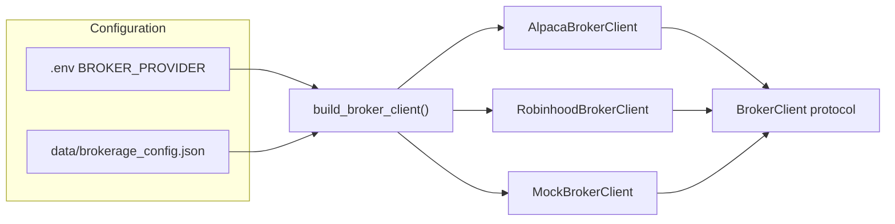

# Multi-broker support

Phase 5 introduces a broker abstraction layer so the trading pipeline can run against Alpaca, Robinhood, or a mock broker without changing strategizer, analyzer, or execution logic.

## Architecture



**Market data stays on Alpaca** (`AlpacaMarketDataProvider`) by default. Execution broker and signal data are decoupled — you can execute on Robinhood while still using Alpaca bars for analysis.

## Broker interface

Location: [`trading_agent/broker/base.py`](../../trading_agent/broker/base.py)

| Method | Returns |
|--------|---------|
| `get_account()` | `BrokerAccount` |
| `get_positions()` | `list[BrokerPosition]` |
| `get_orders()` | `list[BrokerOrder]` |
| `place_market_order(symbol, qty, side)` | `BrokerOrderResult` |
| `get_portfolio_history(...)` | `PortfolioHistory` |

Domain types live in [`trading_agent/domain/broker/`](../../trading_agent/domain/broker/).

## Configuration

### Environment variables

```bash
BROKER_PROVIDER=alpaca    # alpaca | robinhood | mock

# Alpaca (default; paper trading supported)
ALPACA_API_KEY=...
ALPACA_SECRET_KEY=...
ALPACA_PAPER=true

# Robinhood (live only — see risks below)
ROBINHOOD_USERNAME=...
ROBINHOOD_PASSWORD=...
ROBINHOOD_MFA_SECRET=...           # TOTP secret if MFA enabled
ROBINHOOD_SESSION_PATH=...         # optional persisted session file
ROBINHOOD_LIVE_TRADING_ACK=true    # required explicit opt-in
```

### JSON config

[`data/brokerage_config.json`](../../data.example/brokerage_config.json) stores defaults (`provider`, `paper_mode`, `account_label`). Env vars override JSON when building the client.

## Providers

### Alpaca (recommended default)

- Official API with first-class paper trading (`ALPACA_PAPER=true`)
- Used for live cycles, account history, and market data
- Implementation: [`trading_agent/broker/alpaca_client.py`](../../trading_agent/broker/alpaca_client.py)

### Mock

- CI-safe test double returning typed domain objects
- Set `BROKER_PROVIDER=mock` for local dry runs without API keys
- Implementation: [`trading_agent/broker/mock_client.py`](../../trading_agent/broker/mock_client.py)

### Robinhood (optional, live only)

**Robinhood does not offer paper trading or an official public equities REST API.**

The `RobinhoodBrokerClient` uses the unofficial [`robin_stocks`](https://github.com/jmfernandes/robin_stocks) library against Robinhood's private endpoints.

| Risk | Detail |
|------|--------|
| ToS | Robinhood prohibits third-party trading APIs without written authorization |
| Account freeze | Users have reported restrictions when using unofficial APIs |
| Auth breakage | MFA and private endpoints change without notice |
| Real money only | No sandbox; all orders use live funds |

**Safeguards in this repo:**

- `ROBINHOOD_LIVE_TRADING_ACK=true` required before connect
- Startup warning logged when `BROKER_PROVIDER=robinhood`
- Optional dependency: `pip install -r requirements-optional.txt`
- CI uses `MockBrokerClient`; live tests in `tests/integration/test_robinhood_live.py` skip without credentials

**Install optional deps:**

```bash
pip install -r requirements-optional.txt
```

**Live integration smoke test (local only):**

> **TODO:** Live Robinhood E2E has not been verified in CI or by maintainers yet. The tests below are scaffolded and skip without credentials; run locally when ready.

```bash
export ROBINHOOD_USERNAME=...
export ROBINHOOD_PASSWORD=...
export ROBINHOOD_MFA_SECRET=...        # if applicable
export ROBINHOOD_LIVE_TRADING_ACK=true
RUN_INTEGRATION=1 .venv/bin/python -m unittest tests.integration.test_robinhood_live -v
```

Optional order test (places a real 1-share market buy):

```bash
export ROBINHOOD_PLACE_TEST_ORDER=true
export ROBINHOOD_TEST_SYMBOL=AAPL
```

## Factory usage

```python
from trading_agent.broker import build_broker_client

broker = build_broker_client()  # reads BROKER_PROVIDER from env
account = broker.get_account()
positions = broker.get_positions()
```

Inject into `TradingAgent`:

```python
from trading_agent.broker import MockBrokerClient

agent = TradingAgent(
    llm_client=llm,
    market_data_provider=market_data,
    broker_client=MockBrokerClient(),
)
```

The deprecated `alpaca_client=` parameter is still accepted as an alias for `broker_client=`.

## Testing without Robinhood paper trading

Because Robinhood has no paper mode:

1. **Unit / CI** — `BROKER_PROVIDER=mock` or `MockBrokerClient`
2. **E2E paper cycles** — keep `BROKER_PROVIDER=alpaca` with paper keys
3. **Backtest** — `BacktestBroker` in [`trading_agent/backtest/broker.py`](../../trading_agent/backtest/broker.py)
4. **Live Robinhood** — integration tests only, with explicit ack env vars

### Robinhood E2E checklist (TODO)

- [ ] Level 1: `test_account_and_positions_smoke` passes with live credentials
- [ ] Level 2: `run_account_history.py` succeeds with `BROKER_PROVIDER=robinhood`
- [ ] Level 3 (optional): order smoke with `ROBINHOOD_PLACE_TEST_ORDER=true`
- [ ] Level 4: `run_agent.py` with `LLM_PROVIDER=mock` reads Robinhood portfolio in cycle

## Future: Agentic Trading MCP

Robinhood's official [Agentic Trading MCP](https://robinhood.com/us/en/support/articles/agentic-trading-overview/) is MCP-based and uses a separate funded account. A future `RobinhoodMcpBrokerClient` can implement the same `BrokerClient` protocol without changing the pipeline.

## Extension guide

To add a new broker:

1. Add domain mappers in [`trading_agent/broker/mappers.py`](../../trading_agent/broker/mappers.py)
2. Implement `BrokerClient` in `trading_agent/broker/<provider>_client.py`
3. Register in [`trading_agent/broker/factory.py`](../../trading_agent/broker/factory.py)
4. Add config validation in [`trading_agent/config.py`](../../trading_agent/config.py)
5. Add mock-based unit tests; optional live tests under `tests/integration/`
