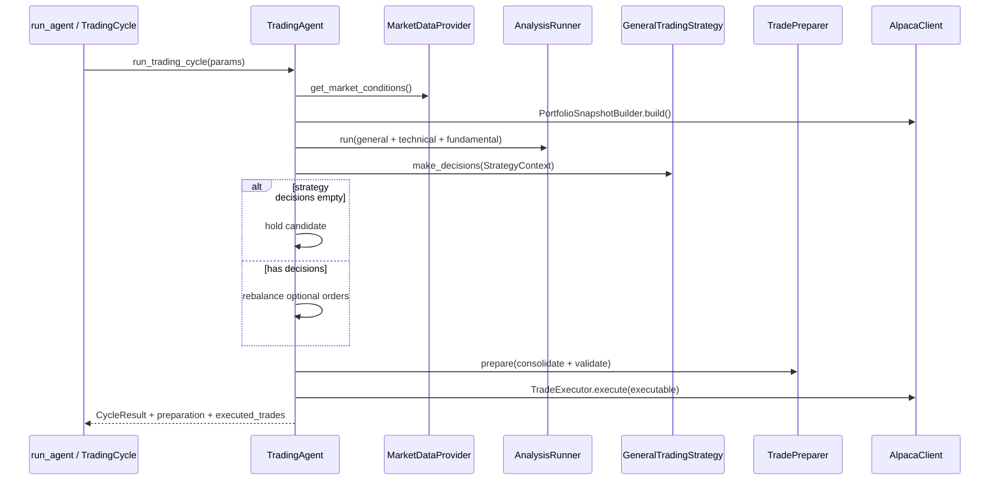

# Trading cycle flow

## Entry points

| Script | Behavior |
|--------|----------|
| `run_agent.py` | One cycle; validates config; saves artifact; prints summary |
| `run_account_history.py` | One account history fetch; Alpaca keys only; saves `logs/account_history_*.json` |
| `trading_service.py` | Loops forever via `TradingScheduler` every `TRADING_CYCLE_INTERVAL` minutes |

Both trading scripts delegate to `trading_agent/orchestrator/`. Account history is separate — see **[account-history.md](account-history.md)**.

## Sequence

## Cycle result shape

Successful cycles return a dict including:

- `status`: `"success"` or `"failed"`
- `cycle_id`, `timestamp`
- `market_conditions`, `market_analysis`
- `analysis`, `analysis_strategy` (`"All Analysis Strategies"`)
- `decisions`: consolidated list after preparation
- `preparation`: `{raw, consolidated, executable, adjusted, skipped}`
- `hold`: bool
- `rebalancing`: plan dict or null
- `executed_trades`: list with `status`, `order_id` or `failure_detail`

Artifacts are written to `logs/cycle_<timestamp>_<id>.json`.

## HOLD semantics

An empty decision list from the strategy is **valid** — treated as HOLD. Rebalancing may still append orders; preparation may skip or clip them.

## Common failure modes (live paper)

| Symptom | Mitigation |
|---------|------------|
| `insufficient qty` | `TradeValidator` clips SELL to available shares |
| `insufficient buying power` | Validator clips BUY; prompt shows buying power |
| Wash trade | Validator skips when open opposite order exists |
| Duplicate symbol orders | `TradeConsolidator` merges before submit |

## Safe places to change behavior

- **Prompts** — `trading_agent/formatters/`, `strategies/general.py`, `analysis/*.py`
- **Domain models** — `trading_agent/domain/`
- **Pre-trade rules** — `trading_agent/execution/validator.py`, `consolidator.py`
- **Broker submit** — `trading_agent/execution/executor.py`
- **Orchestration** — `trading_agent/orchestrator/agent.py`
- **Summary output** — `run_agent.py`, `orchestrator/cycle.py`
