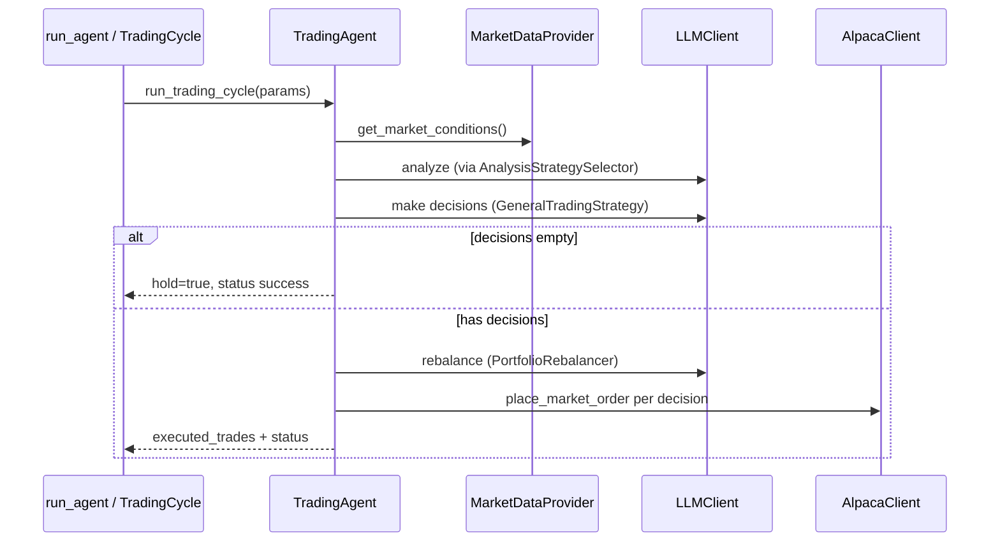

# Trading cycle flow

## Entry points

| Script | Behavior |
|--------|----------|
| `run_agent.py` | One cycle; validates config; saves artifact; prints summary |
| `trading_service.py` | Loops forever via `TradingScheduler` every `TRADING_CYCLE_INTERVAL` minutes |

Both delegate to `agent/trading_cycle.py` → `TradingAgent.run_trading_cycle()`.

## Sequence

## Cycle result shape

Successful cycles return a dict including:

- `status`: `"success"` or `"failed"`
- `cycle_id`, `timestamp`
- `analysis`, `analysis_strategy`, `market_conditions`
- `decisions`: list of `{action, symbol, quantity, reasoning, risk_level}`
- `hold`: bool
- `rebalancing`: plan dict or null
- `executed_trades`: list with `status`, `order_id` or `failure_detail`

Artifacts are written to `logs/cycle_<timestamp>_<id>.json`.

## HOLD semantics

An empty decision list from the strategy is **valid** — treated as HOLD, not an error. Rebalancing may still append sell/buy orders afterward.

## Common failure modes (live paper)

| Symptom | Typical cause |
|---------|----------------|
| `insufficient qty` | LLM requested more shares than held |
| `insufficient buying power` | Margin / short attempt without buying power |
| Gemini `429 limit: 0` | Deprecated model id — use current Gemini 3.x models |
| UUID JSON error | Fixed — order ids must be strings in trade results |

## Safe places to change behavior

- **Prompts / JSON format** — `trading_agent/strategies/general.py`, analysis modules
- **What data LLM sees** — `format_market_conditions()`, portfolio data in `trader.py`
- **Order execution** — `trader.py` → `execute_trades()`
- **Summary output** — `run_agent.py` → `print_cycle_summary()`
