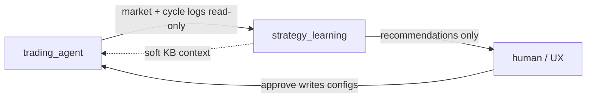

# strategy_learning

Offline learning and tuning for the trading agent. Sibling package to [`trading_agent/`](../trading_agent/).

## Boundary (target)



| Owns (target) | Does not own |
|---------------|--------------|
| Knowledge base | Live trading cycles |
| Param sweep → **recommendations** | Config param files (`data/*.json`) — never write these |
| Live retrospection triggers | Market data writes / decision logs |

`trading_agent` **reads** configs at runtime and (via human / future UX) **applies** approved recommendations. This package **proposes** only.

Backtest engines remain under `trading_agent/backtest/` for now; sweep will invoke them. Deploy (`trading_service.py`) runs **live** mode only — backtest runs must never trigger retrospection (Phase 4.5.2).

## Layout (scaffold — Phase 4.5.1)

```
strategy_learning/
├── __init__.py
├── README.md
├── knowledge/       # Phase 4.5.3 — KB ownership moves here
├── sweep/           # Phase 4.5.4 — param sweep + SweepResult
└── retrospection/   # Phase 4.5.5 — live underperformance → sweep signal
```

Until those sub-phases land, KB / feedback / promotion still live under `trading_agent/agents/`. See [learning-loop.md](../docs/agents/learning-loop.md) and [PROJECT_PLAN.md](../docs/PROJECT_PLAN.md).

## Phase map

| Sub-phase | What lands here |
|-----------|-----------------|
| 4.5.1 | This scaffold + docs |
| 4.5.2 | **Done** (in `trading_agent`) — `LiveAgentRun` / `BacktestAgentRun` |
| 4.5.3 | KB + recommendation writes |
| 4.5.4 | Sweep runner |
| 4.5.5 | Retrospection → sweep |
| Phase 11 | Separate deploy / schedule |
