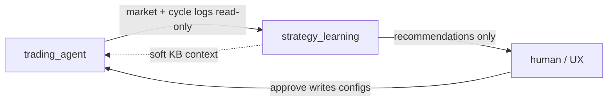

# strategy_learning

Offline learning and tuning for the trading agent. Sibling package to [`trading_agent/`](../trading_agent/).

## Boundary



| Owns | Does not own |
|------|--------------|
| Knowledge base | Live trading cycles |
| Param sweep → **recommendations** | Config param files (`data/*.json`) — never write these |
| Live retrospection triggers (4.5.5) | Market data writes / decision logs |

`trading_agent` **reads** configs at runtime and (via human / future UX) **applies** approved recommendations. This package **proposes** only.

Backtest engines remain under `trading_agent/backtest/`; feedback and sweep invoke them. Deploy (`trading_service.py`) runs **live** mode only — backtest runs must never trigger retrospection (Phase 4.5.2).

## Layout (Phase 4.5.4)

```
strategy_learning/
├── __init__.py
├── README.md
├── knowledge/           # KB ownership (Done — 4.5.3)
│   ├── records.py       # Schema v2 helpers, EventRef
│   ├── store.py         # KnowledgeBase load/save/writes
│   └── feedback.py      # BacktestFeedbackAgent (validations / soft weights)
├── sweep/               # Done — 4.5.4 — OAT param sweep + SweepResult
│   ├── candidates.py
│   ├── models.py
│   ├── recommend.py
│   └── runner.py
├── retrospection/       # Phase 4.5.5 — live underperformance → sweep signal
└── tests/               # Package unit tests
```

Config apply stays in `trading_agent/agents/promotion.py` + `scripts/review_config_recommendation.py`. Live cycle lessons are written by `trading_agent/agents/live_lesson.py` (`LiveLessonAgent`) via this package’s KB API.

Operator sweep CLI: [`run_sweep.py`](../run_sweep.py).

See [learning-loop.md](../docs/agents/learning-loop.md) and [PROJECT_PLAN.md](../docs/PROJECT_PLAN.md).

## Phase map

| Sub-phase | What lands here |
|-----------|-----------------|
| 4.5.1 | Scaffold + docs |
| 4.5.2 | **Done** (in `trading_agent`) — `LiveAgentRun` / `BacktestAgentRun` |
| 4.5.3 | **Done** — KB + recommendation writes |
| 4.5.4 | **Done** — Sweep runner (`ParamSweepRunner`, `run_sweep.py`) |
| 4.5.5 | Retrospection → sweep |
| Phase 11 | Separate deploy / schedule |
